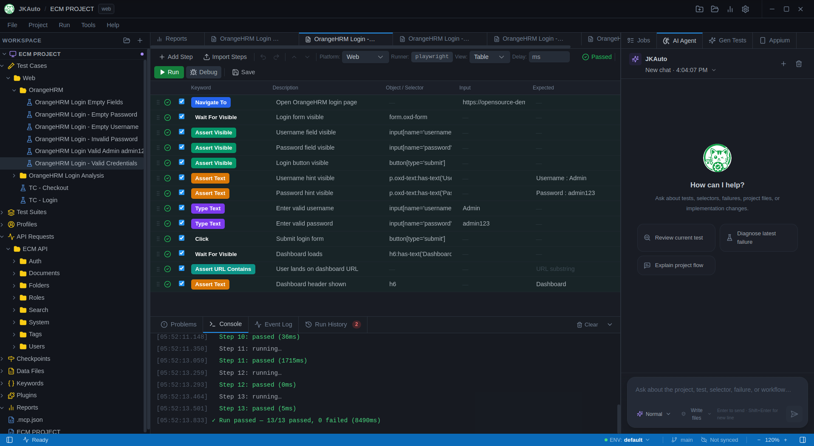

<p align="center">
  
</p>

<h1 align="center">JKAuto</h1>

<p align="center">
  <strong>The test automation IDE that thinks with you.</strong>
</p>

<p align="center">
  <em>Write, run, and iterate on test cases across Web, Mobile, Desktop, and API — visually, with AI assist, no code required.</em>
</p>

<p align="center">
  <a href="https://github.com/nhatcoi/jkauto/releases/latest"></a>
  <a href="#core-features"></a>
  <a href="#how-jkauto-compares"></a>
</p>

<p align="center">
  
  
  
  
</p>

<p align="center">
  
</p>

---

## Project Report

Evaluation report (Group 7): [Group7\_ĐGKĐ(Final).pdf](./Group7_ĐGKĐ\(Final\).pdf)

---

## Why JKAuto?

Most test tools make you choose between **power** and **simplicity**. Katalon is bloated and paywalled. Postman only covers APIs. Cypress and Playwright demand you write code for everything. Selenium IDE is discontinued.

JKAuto is built differently: a **visual IDE** with the depth of a code-first framework — keyword-driven testing, multi-platform execution, AI-assisted test generation, and a data model that's just JSON/YAML files your team can review in a pull request.

---

## Core Features

### Test Cases — Visual Step Editor

Build test cases without writing code. Each step is a row: keyword, target object, input, expected result. Keyboard-navigable, dirty-tracked, undo/redo.

- 15+ built-in keywords: `navigate-to`, `click`, `type-text`, `assert-text`, `wait-for-element`, `take-screenshot`, `drag-drop`, `select-option`, `upload-file`, and more
- Custom keywords — compose built-ins into reusable higher-level actions (e.g. `login-as-admin`)
- Per-step: enable/disable, continue-on-failure, custom timeout
- Inline object reference picker and keyword autocomplete

### Test Suites — Orchestrate at Scale

Group test cases into suites and define execution order, retry policy, and parallelism.

- Compose any mix of test cases across features
- Suite-level profile binding (run `smoke` against staging, `regression` against prod)
- Data-driven: bind a CSV or JSON data file to a suite — each row becomes a separate run

### Multi-Platform Execution

JKAuto's engine is adapter-based. One IDE, multiple runtimes.

Switch platform per project. Engine interface is designed for third-party adapters.

### API Testing — First-Class, Not an Afterthought

Test REST and GraphQL APIs directly inside JKAuto — not in a separate tool.

- Request editor: method, URL, headers, body (JSON / form / raw), auth
- Response viewer: status, latency, body (pretty-printed), headers
- Assert on status code, JSON path, response time, headers
- Chain requests: extract value from response → inject into next step
- Import from OpenAPI / Swagger spec

### Object Repository — Multi-Locator, Resilient

Stop breaking tests on every DOM change.

```json
{
  "name": "loginButton",
  "locators": [
    { "strategy": "testid",  "value": "btn-login" },
    { "strategy": "css",     "value": "#login-btn" },
    { "strategy": "xpath",   "value": "//button[text()='Login']" }
  ]
}
```

Locators tried in order — first one that resolves wins. Visual locator editor with live highlight in the browser (coming in M5).

### Environment Profiles — One Codebase, Many Environments

```json
// profiles/staging.env.json
{ "baseUrl": "https://staging.example.com", "apiKey": "..." }
```

Inject variables into any step input: `${baseUrl}/login`. Switch the active profile from the status bar in one click. No hard-coded URLs anywhere in your tests.

### AI Agent — Vibe Test

Describe what you want to test in plain language. The AI agent reads your keyword registry and object repository, generates a complete test case draft, and puts it in the editor for your review before saving.

- **Context-aware**: agent knows your available keywords, objects, and test patterns
- **Draft-first**: AI output is a validated JSON structure — never raw text injected directly into tests
- **Iterative**: chat back and forth to refine steps, add assertions, or generate edge cases
- **Vibe testing**: describe a user journey in one sentence → get a full multi-step test case

> *"User logs in with valid credentials and lands on the dashboard"*
> → 6-step test case with assertions, generated in seconds.

### Execution & Live Reporting

- Steps stream in real-time: pass ✓, fail ✗, running ⟳
- Screenshot captured on failure automatically
- Console pane: browser logs, network errors, custom log statements
- Run history persisted to SQLite — compare pass rates across runs
- HTML report per run — shareable without the IDE

### Git-Friendly by Design

Every test artifact is a plain file:

```
test-cases/login-success.test.json
test-suites/smoke.suite.json
api-request/login-page.objects.json
```

Diff test changes in PR review. Resolve conflicts in any editor. No binary formats, no proprietary databases in version control.

---

## How JKAuto Compares

| | **JKAuto** | Katalon Studio | Postman | Playwright | Cypress |
|---|---|---|---|---|---|
| **Visual no-code editor** | ✅ | ✅ | ✅ | ❌ | ❌ |
| **Web UI testing** | ✅ | ✅ | ❌ | ✅ | ✅ |
| **API testing** | ✅ | ✅ | ✅ | ⚠️ basic | ❌ |
| **Mobile testing** |✅ | ✅ (paid) | ❌ | ❌ | ❌ |
| **Desktop app testing** | ✅ | ❌ | ❌ | ✅ Electron | ❌ |
| **AI test generation** | ✅ Trial | ⚠️ (paid add-on) | ❌ | ❌ | ❌ |
| **Git-native file format** | ✅ JSON/YAML | ⚠️ XML | ❌ | ✅ | ✅ |
| **Open source** | ✅ MIT | ❌ | ❌ | ✅ | ✅ |
| **No install / lightweight** | ✅ | ❌ heavy JVM | ✅ | CLI only | CLI only |
| **Data-driven testing** | ✅ | ✅ (paid) | ✅ | ✅ | ✅ |
| **Custom keywords / plugins** | ✅ | ✅ (paid) | ✅ scripts | ✅ | ✅ |
| **Environment profiles** | ✅ | ✅ | ✅ | manual | manual |
| **Realtime execution log** | ✅ | ✅ | ✅ | ✅ | ✅ |
| **Run without IDE** | ✅ CLI | ✅ | ✅ Newman | ✅ | ✅ |
| **Price** | **Free/Pro** | Freemium / $$$  | Freemium / $$$ | Free | Free |

> ✅ Supported · ⚠️ Partial / limited · ❌ Not supported

**Bottom line:**
- Katalon gives you a lot but it's Java-heavy, slow to start, and locks key features behind a paywall.
- Postman is great for APIs but stops there.
- Playwright and Cypress are powerful but code-first — no IDE, no visual editor, no path for non-developers.
- JKAuto aims to be the tool where a QA engineer and a developer can both feel at home.


---

## Contributing

Pull requests are welcome. Read [CONTRIBUTING.md](CONTRIBUTING.md) before opening one.

## Code of Conduct

This project follows the [Contributor Covenant](CODE_OF_CONDUCT.md).

## License

[MIT](LICENSE) © 2026 nhatcoi
