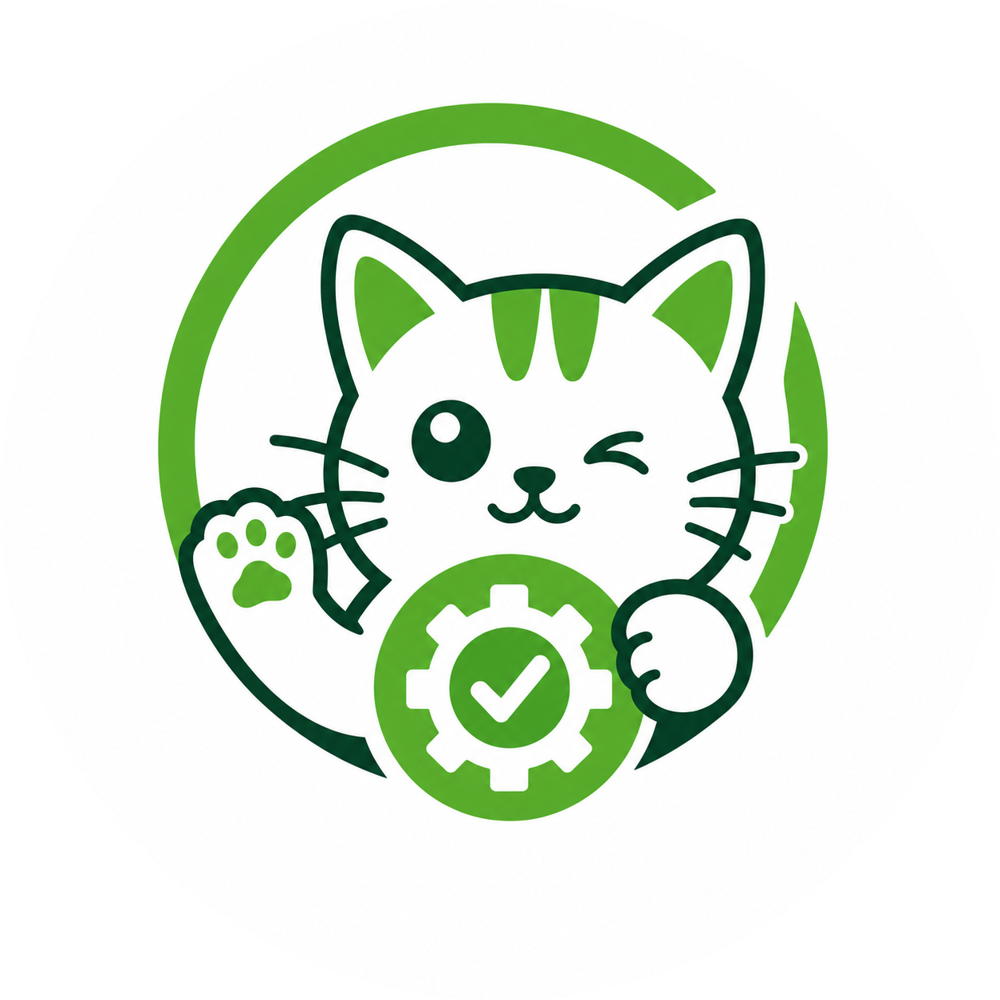

<p align="center">
  
</p>

<h1 align="center">JKAuto</h1>

<p align="center">
  A Katalon-style desktop IDE for automated testing — built on Electron, React, and Playwright.
</p>

<p align="center">
  
  
  
  
  
</p>

---

## What is JKAuto?

JKAuto is an open-source desktop IDE for building, organizing, and running automated test suites — no coding required. Inspired by Katalon Studio, it gives QA engineers a visual interface to manage test cases, object repositories, test suites, and keyword libraries while keeping everything in human-readable JSON/YAML files that work naturally with Git.

> **Status:** Active development — core explorer, project lifecycle, and test case editor are functional. Engine execution, reports, and AI agent are on the roadmap.

---

## Features

- **Project-based workspace** — initialize a project with name, type (web/mobile/desktop/api), icon, and format (JSON or YAML); folder structure generated automatically
- **File Explorer** — virtual tree with per-type icons, inline rename, context menu (new file, delete, open folder), FS watch via chokidar
- **Test Case Editor** — table-driven step editor: keyword, object reference, input, expected — dirty tracking and undo
- **Object Repository** — multi-locator fallback strategy per element (test-id, CSS, XPath…)
- **Test Suites** — compose test cases into suites, configure execution order
- **Keyword Library** — built-in and custom keywords, compose from primitives
- **Environment Profiles** — switch between `default`, `staging`, `production` env files; template variables in steps (`${baseUrl}/login`)
- **Zoom** — Cmd+= / Cmd+- / Cmd+0 zoom with persistence across sessions
- **Keyboard shortcuts** — Mod+N new project, Mod+O open project, Mod+, settings
- **Dark / Light / System theme** — persisted per user

**Coming soon**

- Playwright execution engine with real-time step progress and screenshots
- Run history and reports (SQLite-backed)
- AI agent chat that generates test case drafts from natural language
- Recorder via Playwright codegen
- Clerk-based cloud sync

---

## Tech Stack

| Layer | Technology |
|---|---|
| Shell | Electron 32 |
| Frontend | React 18 + Vite + TypeScript + Tailwind + shadcn/ui |
| State | Zustand + TanStack Query |
| Tree | react-arborist |
| Panes | react-resizable-panels |
| Engine | Playwright (child process) |
| Storage | better-sqlite3 (runs, cache, index) |
| Schema | Zod — single source of truth for all file formats |
| Monorepo | pnpm + Turborepo |

---

## Project Structure

```
jkauto/
├── apps/
│   └── desktop/          # Electron app (main + preload + renderer)
├── packages/
│   ├── core/             # Zod schemas, IPC contract, shared types
│   ├── engine/           # Playwright runner, keyword executor
│   ├── project-fs/       # Read/write project files, JSON↔YAML adapter
│   ├── storage/          # SQLite: runs.db, cache.db, index.db
│   └── ui/               # Shared shadcn components
└── turbo.json
```

Test project files follow this structure:

```
MyProject/
├── project.json
├── profiles/
├── test-cases/
├── test-suites/
├── object-repository/
├── keywords/
├── reports/
└── .autotest/            # Derived cache — gitignored
```

---

## Getting Started

### Prerequisites

- Node.js 22+
- pnpm 11+

### Install

```bash
git clone https://github.com/nhatcoi/jkauto.git
cd jkauto
pnpm install
```

### Run in development

```bash
pnpm dev
```

### Build

```bash
pnpm build
```

---

## Keyboard Shortcuts

| Shortcut | Action |
|---|---|
| `Cmd/Ctrl + N` | New Project |
| `Cmd/Ctrl + O` | Open Project |
| `Cmd/Ctrl + ,` | App Settings |
| `Cmd/Ctrl + =` | Zoom In |
| `Cmd/Ctrl + -` | Zoom Out |
| `Cmd/Ctrl + 0` | Reset Zoom |
| `F2` | Rename selected item |
| `Delete` | Delete selected item |

---

## Roadmap

| Milestone | Description | Status |
|---|---|---|
| M0 Scaffold | Electron + Vite + shadcn, IPC contract, resizable panes | ✅ |
| M1 Project lifecycle | Init dialog, open/recent, folder generation | ✅ |
| M2 Explorer | FS tree, chokidar watch, context menu, file ops | ✅ |
| M3 Test case editor | Table step editor, keyword autocomplete, dirty/undo | 🚧 |
| M4 Engine v1 | ~15 built-in keywords, Playwright runner, realtime console | ⬜ |
| M5 Object repo + Suites | Object editor, multi-locator, suite runner | ⬜ |
| M6 Reports + SQLite | Run history, step results, screenshots, problems pane | ⬜ |
| M7 Profiles + Data-driven | Env switching, CSV/JSON data binding | ⬜ |
| M8 Cloud sync | Clerk auth, project metadata sync | ⬜ |
| M9 AI Agent | Chat pane, generate test drafts from keyword context | ⬜ |
| M10 Polish | Playwright recorder, import/export, plugin API | ⬜ |

---

## Contributing

Contributions are welcome. Please read [CONTRIBUTING.md](CONTRIBUTING.md) before opening a pull request.

---

## Code of Conduct

This project follows the [Contributor Covenant](CODE_OF_CONDUCT.md). Be respectful.

---

## License

[MIT](LICENSE) © 2024 nhatcoi
