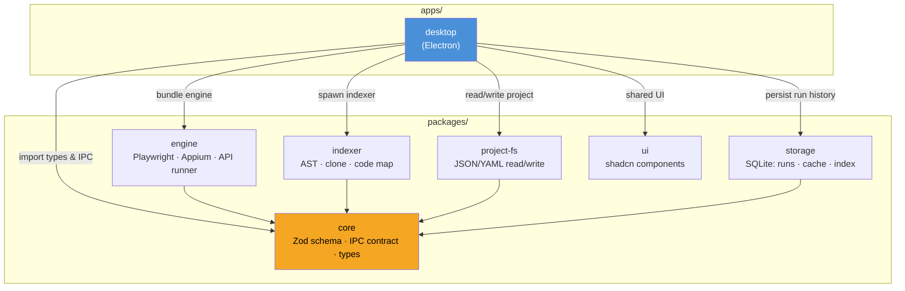
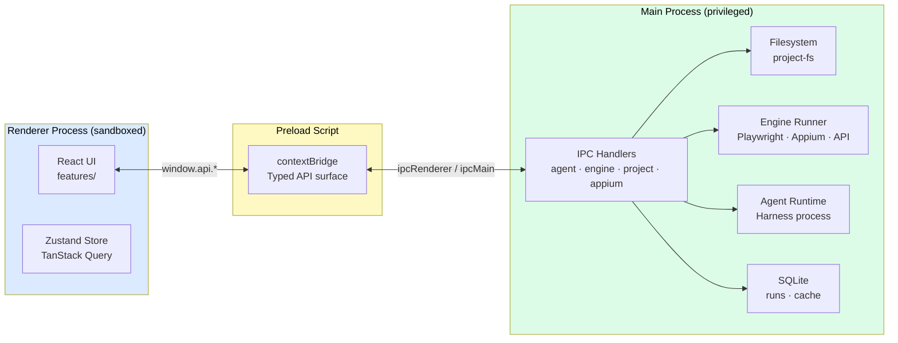
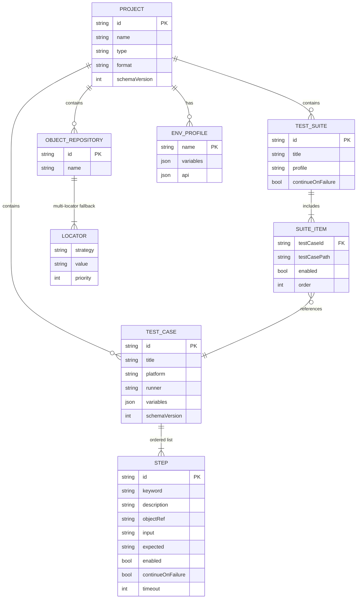
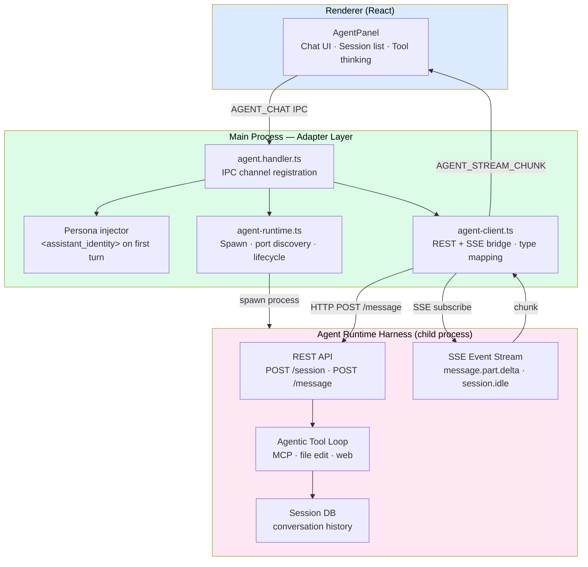
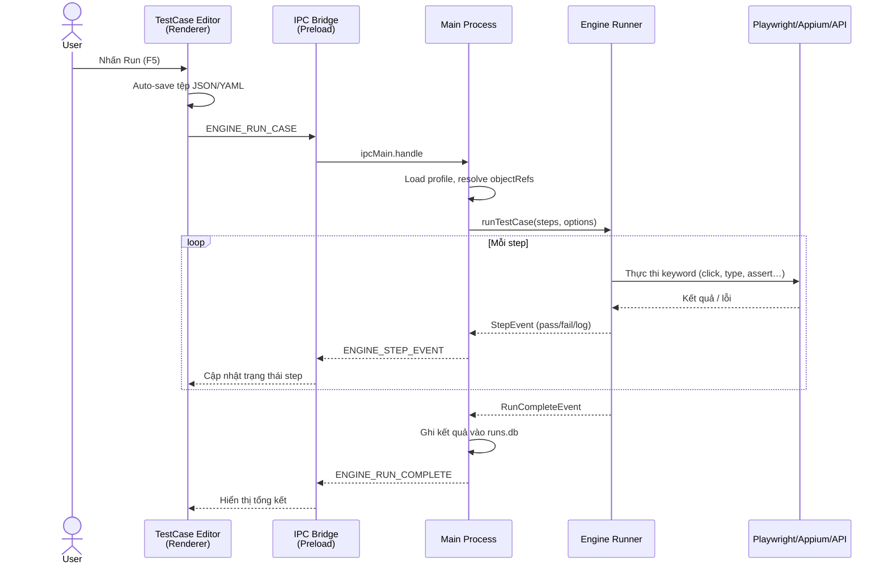
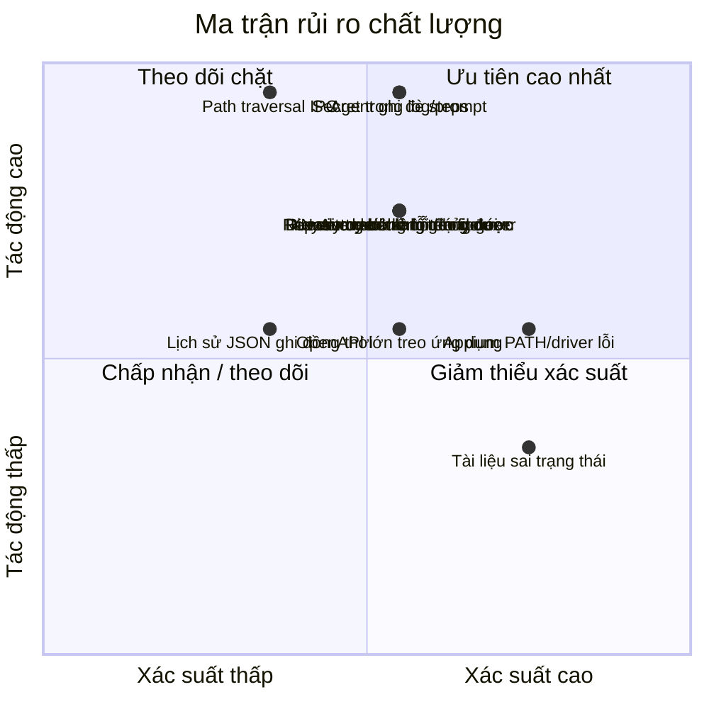

# BÁO CÁO ĐỒ ÁN HỌC PHẦN

## ĐÁNH GIÁ VÀ KIỂM ĐỊNH CHẤT LƯỢNG PHẦN MỀM

### Đề tài: Đánh giá và kiểm định chất lượng hệ thống JKAuto

**Sản phẩm:** Nền tảng thiết kế và thực thi kiểm thử tự động đa nền tảng

**Tên sản phẩm:** JKAuto

**Năm thực hiện:** 2026

### Thành viên nhóm

| STT | Họ và tên | Vai trò đề xuất |
|---:|---|---|
| 1 | Nguyễn Văn Nhật | Trưởng nhóm, kiến trúc hệ thống và tổng hợp báo cáo |
| 2 | Nguyễn Kiều Trinh | Phân tích yêu cầu, đánh giá giao diện và khả năng sử dụng |
| 3 | Quách Hữu Nam | Thiết kế kiểm thử, đánh giá engine và khả năng tương thích |
| 4 | Lê Thị Kiều Trang | Đánh giá chất lượng, quản lý tài liệu và kiểm tra báo cáo |

> Thông tin trường, khoa, lớp học phần và giảng viên hướng dẫn có thể được bổ sung trước khi nộp báo cáo.

---

# MỤC LỤC

- [TÓM TẮT](#tóm-tắt)
- [PHẦN I. TỔNG QUAN ĐỀ TÀI VÀ CƠ SỞ ĐÁNH GIÁ](#phần-i-tổng-quan-đề-tài-và-cơ-sở-đánh-giá)
  - [1.1. Lý do chọn đề tài](#11-lý-do-chọn-đề-tài)
  - [1.2. Mục tiêu của đề tài](#12-mục-tiêu-của-đề-tài)
  - [1.3. Đối tượng và phạm vi nghiên cứu](#13-đối-tượng-và-phạm-vi-nghiên-cứu)
  - [1.4. Phương pháp thực hiện](#14-phương-pháp-thực-hiện)
  - [1.5. Cơ sở lý thuyết và tiêu chí chất lượng](#15-cơ-sở-lý-thuyết-và-tiêu-chí-chất-lượng)
  - [1.6. Nguồn tài liệu khảo sát](#16-nguồn-tài-liệu-khảo-sát)
- [PHẦN II. PHÂN TÍCH HỆ THỐNG JKAUTO](#phần-ii-phân-tích-hệ-thống-jkauto)
  - [2.1. Tổng quan sản phẩm](#21-tổng-quan-sản-phẩm)
  - [2.2. Kiến trúc tổng thể](#22-kiến-trúc-tổng-thể)
  - [2.3. Mô hình dữ liệu và tổ chức dự án](#23-mô-hình-dữ-liệu-và-tổ-chức-dự-án)
  - [2.4. Phân tích các chức năng chính](#24-phân-tích-các-chức-năng-chính)
    - [2.4.8. Sinh kiểm thử từ repository](#248-sinh-kiểm-thử-từ-repository)
    - [2.4.9. JKAuto Skills](#249-jkauto-skills)
  - [2.5. Luồng thực thi kiểm thử](#25-luồng-thực-thi-kiểm-thử)
  - [2.6. Công nghệ sử dụng](#26-công-nghệ-sử-dụng)
  - [2.7. Các quyết định thiết kế ảnh hưởng đến chất lượng](#27-các-quyết-định-thiết-kế-ảnh-hưởng-đến-chất-lượng)
- [PHẦN III. ĐÁNH GIÁ VÀ KIỂM ĐỊNH CHẤT LƯỢNG](#phần-iii-đánh-giá-và-kiểm-định-chất-lượng)
  - [3.1. Chiến lược đánh giá](#31-chiến-lược-đánh-giá)
  - [3.2. Đánh giá theo mô hình chất lượng](#32-đánh-giá-theo-mô-hình-chất-lượng)
  - [3.3. Kiểm định yêu cầu chức năng](#33-kiểm-định-yêu-cầu-chức-năng)
  - [3.4. Kiểm định dữ liệu và schema](#34-kiểm-định-dữ-liệu-và-schema)
  - [3.5. Kiểm định engine và khả năng tương thích](#35-kiểm-định-engine-và-khả-năng-tương-thích)
  - [3.6. Kiểm định API](#36-kiểm-định-api)
  - [3.7. Kiểm định AI Agent](#37-kiểm-định-ai-agent)
  - [3.8. Kiểm định phi chức năng](#38-kiểm-định-phi-chức-năng)
  - [3.9. Ma trận rủi ro chất lượng](#39-ma-trận-rủi-ro-chất-lượng)
  - [3.10. Nhận xét về mức độ sẵn sàng](#310-nhận-xét-về-mức-độ-sẵn-sàng)
- [PHẦN IV. KẾT LUẬN VÀ HƯỚNG PHÁT TRIỂN](#phần-iv-kết-luận-và-hướng-phát-triển)
  - [4.1. Kết quả đạt được](#41-kết-quả-đạt-được)
  - [4.2. Hạn chế](#42-hạn-chế)
  - [4.3. Đề xuất cải tiến chất lượng](#43-đề-xuất-cải-tiến-chất-lượng)
  - [4.4. Phân công công việc](#44-phân-công-công-việc)
  - [4.5. Kết luận chung](#45-kết-luận-chung)
  - [4.6. Tài liệu tham khảo nội bộ](#46-tài-liệu-tham-khảo-nội-bộ)

---

# TÓM TẮT

JKAuto là một môi trường phát triển tích hợp phục vụ thiết kế, quản lý và thực thi kiểm thử tự động trên nhiều nền tảng, gồm Web, Desktop, Mobile, Appium và API. Hệ thống hướng tới việc kết hợp sự trực quan của công cụ no-code với khả năng mở rộng của các framework kiểm thử theo mã nguồn. Người dùng có thể tạo test case dưới dạng bảng, tổ chức test suite, quản lý đối tượng giao diện, cấu hình môi trường, gửi yêu cầu API, theo dõi lịch sử chạy, sinh test từ repository nguồn và sử dụng AI Agent để kiểm tra luồng thật trên Chromium trước khi lưu kịch bản.

Báo cáo này tập trung đánh giá chất lượng của JKAuto dựa trên tài liệu Markdown, cấu trúc mã nguồn và lịch sử commit hiện có trong dự án. Nguồn khảo sát gồm tài liệu giới thiệu, kế hoạch kiến trúc, hướng dẫn đóng góp, tài liệu riêng của từng feature, schema, IPC contract, service chính, bộ keyword, quy trình gỡ lỗi và các dự án mẫu. Việc đánh giá được tổ chức theo các nhóm thuộc tính chất lượng phổ biến của ISO/IEC 25010: phù hợp chức năng, hiệu năng, tương thích, khả năng sử dụng, độ tin cậy, bảo mật, khả năng bảo trì và tính khả chuyển.

Kết quả khảo sát tài liệu, mã nguồn và các commit gần nhất cho thấy hệ thống có định hướng kiến trúc rõ ràng, mô hình dữ liệu có version, phân tách renderer với quyền truy cập hệ thống thông qua IPC, hỗ trợ nhiều runner và ưu tiên định dạng JSON/YAML thân thiện với Git. Các feature quan trọng như Test Case, Test Suite, API Request, Object Repository, Appium, repository indexer và AI Agent đã được triển khai theo các module tương đối rõ. Tuy nhiên, dự án chưa thể hiện một bộ kiểm thử tự động cấp mã nguồn trong cấu trúc hiện tại; một số thao tác hủy vẫn là placeholder, đồng thời trạng thái milestone trong tài liệu kế hoạch chưa được cập nhật đồng bộ với mã nguồn mới hơn.

Vì vậy, báo cáo không xem các mô tả chức năng là bằng chứng tuyệt đối rằng mọi chức năng đã vượt qua kiểm định thực tế. Các kết luận được chia thành hai mức: đánh giá dựa trên thiết kế/tài liệu và các ca kiểm thử cần thực thi để xác nhận chất lượng. Hướng cải tiến ưu tiên là xây dựng test pyramid, chuẩn hóa truy vết yêu cầu, tự động hóa kiểm tra trong CI, bổ sung đo lường hiệu năng và tăng cường kiểm soát an toàn cho AI Agent, thông tin xác thực và các công cụ có quyền ghi tệp.

**Từ khóa:** kiểm thử phần mềm, đảm bảo chất lượng, kiểm định phần mềm, Playwright, Appium, API testing, Electron, AI Agent, ISO/IEC 25010.

---

# PHẦN I. TỔNG QUAN ĐỀ TÀI VÀ CƠ SỞ ĐÁNH GIÁ

## 1.1. Lý do chọn đề tài

Kiểm thử phần mềm hiện đại thường phải xử lý đồng thời nhiều loại đối tượng: giao diện Web, ứng dụng Desktop, thiết bị Mobile, dịch vụ API và dữ liệu môi trường. Các công cụ hiện có thường tối ưu cho một nhóm người dùng hoặc một loại nền tảng cụ thể. Công cụ trực quan dễ tiếp cận có thể hạn chế khả năng mở rộng, trong khi framework mạnh như Playwright hoặc Appium đòi hỏi người sử dụng có kỹ năng lập trình.

JKAuto được xây dựng để giải quyết khoảng cách này bằng một IDE trực quan, trong đó các test step được biểu diễn bằng keyword và lưu thành tệp JSON/YAML. Sản phẩm có ý nghĩa phù hợp với học phần Đánh giá và kiểm định chất lượng phần mềm vì bản thân JKAuto vừa là đối tượng cần đánh giá, vừa là công cụ hỗ trợ hoạt động kiểm thử.

Đề tài được lựa chọn vì các lý do chính:

1. Sản phẩm có phạm vi đủ lớn để đánh giá nhiều thuộc tính chất lượng.
2. Hệ thống sử dụng kiến trúc đa tiến trình và nhiều công nghệ tích hợp.
3. Dữ liệu kiểm thử có schema rõ ràng, thuận lợi cho việc kiểm định tính đúng đắn.
4. Có nhiều luồng nghiệp vụ quan trọng như chạy test case, chạy suite, kiểm thử API, điều khiển Appium và tương tác với AI Agent.
5. Dự án có định hướng mã nguồn mở và lưu trữ artifact thân thiện với Git, phù hợp để đánh giá khả năng bảo trì.

## 1.2. Mục tiêu của đề tài

### 1.2.1. Mục tiêu tổng quát

Phân tích, đánh giá và đề xuất quy trình kiểm định chất lượng cho hệ thống JKAuto, từ đó xác định điểm mạnh, điểm hạn chế, rủi ro và mức độ sẵn sàng của sản phẩm.

### 1.2.2. Mục tiêu cụ thể

- Mô tả kiến trúc, mô hình dữ liệu và các feature chính của JKAuto.
- Xác định yêu cầu chức năng và phi chức năng cần kiểm định.
- Đánh giá thiết kế theo các đặc tính chất lượng phần mềm.
- Xây dựng ma trận ca kiểm thử đại diện cho các luồng quan trọng.
- Phân tích rủi ro liên quan đến runner, IPC, dữ liệu, Appium, API và AI Agent.
- Đề xuất giải pháp nâng cao khả năng kiểm thử tự động, bảo trì và phát hành.
- Phân biệt rõ giữa chức năng được mô tả trong tài liệu và chức năng đã có bằng chứng kiểm thử.

## 1.3. Đối tượng và phạm vi nghiên cứu

### 1.3.1. Đối tượng nghiên cứu

Đối tượng nghiên cứu là mã nguồn và tài liệu thiết kế của hệ thống JKAuto, tập trung vào:

- Ứng dụng Desktop xây dựng bằng Electron.
- Renderer React cung cấp giao diện người dùng.
- Main process xử lý tệp, tiến trình, Appium, HTTP và runner.
- Package `core` chứa schema và hợp đồng IPC.
- Package `engine` thực thi keyword bằng Playwright, Appium, API hoặc Maestro.
- Package `indexer` clone và phân tích repository để tạo code map phục vụ sinh test.
- Các feature Test Case, Test Suite, Explorer, API Request, Object Repository, Appium và AI Agent.
- Feature Autogen Test sinh test từ route, phần tử giao diện và API endpoint được phát hiện.
- Bộ JKAuto Skills hỗ trợ tạo test case, chọn keyword và chẩn đoán lỗi.
- Các dự án mẫu dùng cho kiểm thử API và automation CLI.

### 1.3.2. Phạm vi đánh giá

Báo cáo thực hiện:

- Đánh giá tĩnh dựa trên tài liệu kiến trúc và quy ước dự án.
- Đánh giá khả năng truy vết giữa feature, dữ liệu và IPC.
- Thiết kế ca kiểm thử chức năng và phi chức năng.
- Nhận diện rủi ro và đề xuất tiêu chí chấp nhận.

Báo cáo không tuyên bố:

- Tất cả ca kiểm thử đã được chạy trên mọi hệ điều hành.
- Các chỉ số hiệu năng đã được đo bằng công cụ benchmark.
- Hệ thống đã vượt qua kiểm thử bảo mật chuyên sâu.
- Các feature được mô tả đều đã sẵn sàng phát hành ở mức production.

## 1.4. Phương pháp thực hiện

Nhóm sử dụng các phương pháp sau:

1. **Khảo sát tài liệu:** ...
2. **Phân loại nguồn:** ...
3. **Đối chiếu chéo:** ...
4. **Phân tích kiến trúc:** ...
5. **Đánh giá theo tiêu chí:** ...
6. **Thiết kế kiểm thử:** ...
7. **Đánh giá bằng chứng:** ...

### Quy tắc ưu tiên tài liệu

Khi có thông tin không đồng nhất, báo cáo áp dụng thứ tự ưu tiên:

1. Tài liệu feature mới nhất trong `apps/desktop/.../features/*/AGENTS.md`.
2. Tài liệu schema và keyword trong `jkauto-skills`.
3. `README.md` và tài liệu hướng dẫn đóng góp.
4. `PLAN.md` dùng làm kiến trúc và roadmap nền.
5. `CONTINUE.md` chỉ được xem là nhật ký phát triển lịch sử.

## 1.5. Cơ sở lý thuyết và tiêu chí chất lượng

### 1.5.1. Đảm bảo chất lượng và kiểm định

Đảm bảo chất lượng phần mềm là tập hợp hoạt động có kế hoạch nhằm bảo đảm quy trình và sản phẩm đáp ứng yêu cầu. Kiểm định tập trung vào việc xác nhận sản phẩm được xây dựng đúng đặc tả và phù hợp với nhu cầu sử dụng.

Hai câu hỏi cốt lõi:

- **Verification:** Hệ thống có được xây dựng đúng theo thiết kế hay không?
- **Validation:** Hệ thống có giải quyết đúng nhu cầu của người dùng hay không?

### 1.5.2. Các mức kiểm thử

- **Unit test:** kiểm tra hàm parse, interpolate, schema, keyword và utility độc lập.
- **Integration test:** kiểm tra IPC, đọc/ghi tệp, HTTP handler, database và adapter.
- **System test:** chạy toàn bộ ứng dụng Electron với project mẫu.
- **Acceptance test:** kiểm tra hành trình người dùng từ tạo project đến xem kết quả chạy.
- **Regression test:** xác nhận thay đổi mới không làm hỏng feature hiện có.

### 1.5.3. Mô hình ISO/IEC 25010 áp dụng

| Đặc tính | Nội dung đánh giá trong JKAuto |
|---|---|
| Phù hợp chức năng | Feature có cung cấp đúng hành vi tạo, sửa, chạy và quản lý kiểm thử không |
| Hiệu năng | Thời gian mở project, gửi API, khởi chạy runner, streaming log và render cây tệp |
| Tương thích | Khả năng chạy trên macOS, Windows, Linux và tích hợp Playwright/Appium/Maestro |
| Khả năng sử dụng | Mức trực quan của editor, thông báo lỗi, phím tắt, undo/redo và hướng dẫn |
| Độ tin cậy | Xử lý timeout, dừng run, lỗi runner, lưu lịch sử và phục hồi dữ liệu |
| Bảo mật | Cách ly renderer, xử lý token, giới hạn filesystem MCP và chế độ AI Agent |
| Khả năng bảo trì | Kiến trúc module, TypeScript strict, schema dùng chung, giới hạn độ dài tệp |
| Tính khả chuyển | Electron đa hệ điều hành, file JSON/YAML và adapter cho nhiều runner |

## 1.6. Nguồn tài liệu khảo sát

Tài liệu được chia thành các nhóm:

| Nhóm | Tài liệu tiêu biểu | Vai trò |
|---|---|---|
| Tổng quan | `README.md`, `PLAN.md` | Mục tiêu sản phẩm, kiến trúc, roadmap |
| Quy trình | `CONTRIBUTING.md`, `CODE_OF_CONDUCT.md`, `CLAUDE.md` | Quy ước phát triển và cộng tác |
| Feature | Các tệp `AGENTS.md` | Mô tả chi tiết Test Case, Suite, API, Agent, Appium, Explorer và Autogen |
| Lịch sử mã nguồn | Các commit từ `e8bbf45` đến `ff96ce3` | MenuBar, repository indexer, suite path recovery và Agent Directly |
| Kỹ năng | `jkauto-skills/**/*.md` | Schema test case, keyword, mapping runner, checklist debug |
| Lịch sử | `CONTINUE.md` | Quá trình xây dựng engine và giao diện log |
| Mẫu kiểm thử | `test-project/**/*.md` | API curl và generic automation target |

Việc có tài liệu theo từng feature là một điểm mạnh về khả năng bảo trì. Tuy nhiên, roadmap trong `PLAN.md` còn đánh dấu nhiều milestone chưa hoàn thành trong khi tài liệu feature mô tả chúng đã được triển khai sâu hơn. Đây là dấu hiệu cần quản lý phiên bản tài liệu tốt hơn.

---

# PHẦN II. PHÂN TÍCH HỆ THỐNG JKAUTO

## 2.1. Tổng quan sản phẩm

### 2.1.1. Vị trí sản phẩm

JKAuto là IDE kiểm thử tự động theo hướng keyword-driven và file-first, nhắm đến khoảng trống giữa công cụ no-code (trực quan nhưng hạn chế mở rộng) và framework viết mã (mạnh nhưng yêu cầu kỹ năng lập trình cao).

**Định vị so với công cụ phổ biến:**

| Tiêu chí | Katalon Studio | Playwright/Cypress | JKAuto |
|---|---|---|---|
| Phong cách test | Keyword / record | Viết mã `.ts`/`.js` | Keyword / AI-gen |
| Artifact format | Proprietary binary/XML | Mã nguồn | JSON / YAML |
| Git-friendly | Hạn chế | Tốt | Tốt (file-first) |
| Nền tảng hỗ trợ | Web, Mobile | Web | Web, Mobile, Desktop, API |
| AI tích hợp sẵn | Không | Không | Có |
| Open data format | Không | N/A | Có |
| Yêu cầu lập trình | Thấp | Cao | Thấp – Trung bình |
| CLI / CI-CD | Có | Có | Có (`jkauto run`) |

### 2.1.2. Nhóm người dùng mục tiêu

| Nhóm | Nhu cầu chính | Tính năng JKAuto phục vụ |
|---|---|---|
| QA engineer | Tạo, duy trì test case trực quan | Test Case Editor, keyword autocomplete, Object Repository |
| Developer | Artifact reviewable, CI/CD ready | JSON/YAML output, CLI `jkauto run`, Git diff rõ |
| API tester | Request builder, chain token, assertion | API Request Editor, Save-to-Env, cURL import |
| Mobile tester | Kiểm thử thiết bị thật | Appium integration, device mirror, Inspector |
| AI-assisted tester | Sinh test từ repo, kiểm chứng luồng thật | Autogen Test, Agent Directly mode |

### 2.1.3. Giá trị cốt lõi thiết kế

- **File-first:** artifact là tệp JSON/YAML, commit được, review được, diff được.
- **Keyword-driven:** người dùng dùng keyword có tên rõ ràng thay vì viết API Playwright trực tiếp.
- **Single keyword registry:** metadata keyword là nguồn sự thật chung cho editor và engine — không thể lệch nhau.
- **Tách nguồn và derived data:** JSON/YAML = dữ liệu nguồn; SQLite `.autotest/` = cache có thể tạo lại.
- **AI có kiểm soát:** AI đề xuất hoặc sinh artifact JSON, phải qua schema validate trước khi lưu.

### 2.1.4. Trạng thái phát triển theo milestone

| Milestone | Nội dung | Trạng thái |
|---|---|---|
| M0 | Scaffold Electron + Vite + shadcn, layout panes resize | ✅ |
| M1 | Project lifecycle — dialog, folder structure, open/recent | ✅ |
| M2 | Explorer — react-arborist, chokidar, context menu, file ops | ✅ |
| M3 | Test Case Editor — bảng step, keyword, objectRef, undo/redo | ✅ |
| M4 | Engine v1 — keyword registry, Playwright runner, realtime log | ✅ |
| M4.5 | CLI `jkauto run`, CI/CD workflow generator | ✅ |
| M5 | Object Repository, API Request Editor, Test Suite | ✅ |
| M6 | Reports, SQLite runs.db | ✅ |
| M7 | Profiles, data-driven CSV/JSON | ✅ (một phần) |
| M8 | Clerk + Sync | ☐ |
| M9 | AI Agent | ✅ (đã triển khai vượt roadmap ban đầu) |
| M10 | Recorder, import/export, plugins API | ☐ |

> Trạng thái suy ra từ tài liệu feature và commit history; `PLAN.md` gốc chưa được cập nhật đồng bộ.

## 2.2. Kiến trúc tổng thể

### 2.2.1. Monorepo và phân tách package

Hệ thống dùng pnpm workspace và Turborepo. Mỗi package có ranh giới trách nhiệm rõ:

```text
jkauto/
├── apps/
│   └── desktop/          # Electron app (main + preload + renderer)
│       ├── main/         # Node.js privileged: FS, spawn, HTTP, SQLite, IPC handlers
│       ├── preload/      # IPC bridge — contextBridge typed surface
│       └── renderer/     # React SPA — features by vertical slice
├── packages/
│   ├── core/             # Nguồn sự thật: Zod schema, type, IPC channel names
│   ├── engine/           # Keyword executor + runner adapter factory
│   ├── indexer/          # Clone repo, AST parse, build code map cho Autogen
│   ├── project-fs/       # Đọc/ghi JSON/YAML project files
│   ├── storage/          # SQLite: runs.db, cache.db, index.db
│   └── ui/               # shadcn/ui components dùng chung
├── jkauto-skills/        # Prompt skill cho AI Agent (Markdown)
└── test-project/         # Dự án mục tiêu mẫu (ECM, OrangeHRM…)
```

**Vai trò và ràng buộc từng package:**

| Package | Phụ thuộc chính | Trách nhiệm | Không được làm |
|---|---|---|---|
| `core` | Zod | Schema, type, IPC channel names | Import bất kỳ package monorepo khác |
| `engine` | `@playwright/test`, Appium, `core` | Keyword registry, adapter factory, executor | Truy cập FS, IPC, render UI |
| `indexer` | `simple-git`, ESTree, Swagger Parser, `core` | Clone repo, build code map, lưu index.db | Thực thi test |
| `project-fs` | `yaml`, `core` | Parse/serialize JSON↔YAML, file CRUD | Business logic, IPC |
| `storage` | `better-sqlite3`, `core` | SQLite migration, CRUD run/result/cache | Biết về feature UI |
| `ui` | React, shadcn/ui, Tailwind | Primitive UI components | Feature-specific logic |
| `desktop/main` | Tất cả packages trên | Orchestrate, IPC handler, spawn | Render UI, import renderer code |

**Hình 2.1 — Sơ đồ phụ thuộc giữa các package trong monorepo JKAuto**



### 2.2.2. Kiến trúc Electron — ba lớp và ranh giới IPC

JKAuto áp dụng mô hình bảo mật Electron nghiêm ngặt với ba lớp tách biệt:

**Renderer process (sandboxed)**
- Chạy React SPA, không có quyền Node.js (`nodeIntegration: false`, `contextIsolation: true`).
- Không thể truy cập filesystem, spawn process hay gọi native API trực tiếp.
- Giao tiếp với main process chỉ qua `window.api.*` do preload expose.

**Preload script**
- Cầu nối duy nhất giữa renderer và main.
- Dùng `contextBridge.exposeInMainWorld('api', ...)` cung cấp API surface typed an toàn.
- Mọi hàm là wrapper typed quanh `ipcRenderer.invoke` / `ipcRenderer.on`.

**Main process (privileged)**
- Toàn quyền Node.js: đọc/ghi file, spawn child process, HTTP, SQLite.
- Đăng ký handler cho từng IPC channel qua `ipcMain.handle`.
- Validate payload đầu vào bằng Zod trước khi xử lý (nguyên tắc kiến trúc).

**Danh sách IPC channel theo nhóm:**

| Nhóm | Channel tiêu biểu | Hướng | Mô tả |
|---|---|---|---|
| Project | `PROJECT_OPEN`, `PROJECT_INIT`, `PROJECT_RECENT` | invoke | Mở, tạo, danh sách gần đây |
| Engine | `ENGINE_RUN_CASE`, `ENGINE_RUN_SUITE`, `ENGINE_STOP` | invoke | Điều khiển chạy test |
| Engine events | `ENGINE_STEP_EVENT`, `ENGINE_RUN_COMPLETE` | send (main→renderer) | Stream trạng thái step realtime |
| API | `API_SEND_REQUEST`, `API_HISTORY_LIST` | invoke | Gửi HTTP request, xem lịch sử |
| Agent | `AGENT_CHAT`, `AGENT_SESSION_CREATE`, `AGENT_SESSION_LIST` | invoke | Chat AI, quản lý session |
| Agent stream | `AGENT_STREAM_CHUNK`, `AGENT_STREAM_TOOL_EVENT` | send | Streaming response và tool call |
| Appium | `APPIUM_START`, `APPIUM_STOP`, `APPIUM_DEVICE_LIST` | invoke | Quản lý Appium server và device |
| Appium stream | `APPIUM_MIRROR_FRAME`, `APPIUM_LOG` | send | Luồng mirror màn hình và log |
| Autogen | `AUTOGEN_START`, `AUTOGEN_CANCEL`, `AUTOGEN_PROGRESS` | invoke/send | Pipeline sinh test từ repo |

**Hình 2.2 — Kiến trúc ba tầng Electron và ranh giới IPC**



### 2.2.3. Kiến trúc feature theo vertical slice

Renderer tổ chức theo vertical slice — mỗi feature tự quản lý toàn bộ lifecycle của mình:

```text
renderer/src/features/
├── project/         # Init dialog, open, recent project
├── explorer/        # Cây tệp ảo hóa, context menu, file ops
├── test-cases/      # Step editor, keyword picker, run controls, history
├── api-request/     # HTTP editor, assertion, history, Save-to-Env
├── test-suites/     # Suite composer, batch run, profile chọn
├── object-repo/     # Object editor, locator manager
├── keywords/        # Custom keyword manager
├── execution/       # Run progress pane, realtime console log
├── reports/         # Run history viewer, step results, screenshots
├── appium/          # Server mgmt, device list, inspector, device mirror
├── agent/           # Chat UI, session manager, tool thinking display
└── autogen/         # Repo picker, index progress, test preview và lưu
```

Mỗi feature chứa các tệp theo convention:

| Tệp/Thư mục | Trách nhiệm |
|---|---|
| `components/` | React components thuộc feature |
| `hooks/` | Custom hooks (state, effect, data fetching) |
| `store.ts` | Zustand slice quản lý UI state cục bộ |
| `api.ts` | Wrapper gọi `window.api.*` (IPC calls) |
| `types.ts` | Interface và type cục bộ của feature |
| `AGENTS.md` | Tài liệu kỹ thuật feature cho agent và developer mới |

**Nguyên tắc coupling:** Feature A không import implementation của Feature B trực tiếp. Giao tiếp qua shared Zustand store, TanStack Query cache hoặc IPC event broadcast.

## 2.3. Mô hình dữ liệu và tổ chức dự án

### 2.3.1. Cấu trúc project của người dùng

```text
MyAutoTestProject/
├── project.json              # Metadata: name, type, format, schemaVersion
├── profiles/
│   ├── default.env.json      # Biến môi trường mặc định
│   └── staging.env.json      # Biến môi trường staging
├── test-cases/
│   ├── login-success.test.json
│   └── get-users-api.test.json
├── api-requests/             # Postman-style HTTP explorer
│   └── login.request.json
├── object-repository/        # Web element selectors
│   └── login-page.objects.json
├── test-suites/
│   └── smoke.suite.yaml
├── keywords/                 # Custom keyword definitions
├── data-files/               # CSV/JSON data-driven input
├── reports/                  # <run-id>/: screenshots, HTML
├── checkpoints/
├── plugins/
└── .autotest/                # Derived data — gitignore
    ├── runs.db               # Run history, step results
    ├── cache.db              # Misc cache
    ├── index.db              # Autogen code map
    └── workspace.json        # Layout, open tabs
```

**Nguyên tắc phân tách dữ liệu:**
- Các tệp `*.json` / `*.yaml` trong thư mục project = **dữ liệu nguồn**, commit lên Git.
- Thư mục `.autotest/` = **dữ liệu dẫn xuất**, có thể xóa và tạo lại, không commit.

### 2.3.2. Cấu trúc Test Case

Test case lưu metadata, thông tin platform/runner, biến nội bộ và mảng step có thứ tự.

**Ví dụ file `login-success.test.json`:**

```json
{
  "schemaVersion": 1,
  "id": "550e8400-e29b-41d4-a716-446655440000",
  "title": "Login thành công với tài khoản hợp lệ",
  "platform": "web",
  "runner": "playwright",
  "variables": {
    "expectedTitle": "Dashboard"
  },
  "steps": [
    {
      "id": "step-001",
      "keyword": "navigate-to",
      "description": "Mở trang đăng nhập",
      "objectRef": "",
      "input": "{{baseUrl}}/login",
      "expected": "",
      "enabled": true,
      "continueOnFailure": false,
      "timeout": null
    },
    {
      "id": "step-002",
      "keyword": "type-text",
      "description": "Nhập username",
      "objectRef": "LoginPage.usernameInput",
      "input": "{{username}}",
      "expected": "",
      "enabled": true,
      "continueOnFailure": false,
      "timeout": 5000
    },
    {
      "id": "step-003",
      "keyword": "click",
      "description": "Nhấn nút Login",
      "objectRef": "LoginPage.submitButton",
      "input": "",
      "expected": "",
      "enabled": true,
      "continueOnFailure": false,
      "timeout": null
    },
    {
      "id": "step-004",
      "keyword": "assert-text",
      "description": "Kiểm tra tiêu đề trang sau đăng nhập",
      "objectRef": "DashboardPage.pageTitle",
      "input": "",
      "expected": "{{expectedTitle}}",
      "enabled": true,
      "continueOnFailure": false,
      "timeout": 10000
    }
  ],
  "createdAt": "2026-06-01T08:00:00Z",
  "updatedAt": "2026-06-20T14:30:00Z"
}
```

**Ý nghĩa từng trường step:**

| Trường | Kiểu | Bắt buộc | Ý nghĩa |
|---|---|---|---|
| `id` | string (UUID) | Có | Định danh ổn định — không đổi khi rename test case |
| `keyword` | string | Có | Hành động từ keyword registry |
| `description` | string | Không | Chú thích cho người đọc |
| `objectRef` | string | Tuỳ keyword | Tên object từ repository hoặc selector inline |
| `input` | string | Tuỳ keyword | Giá trị đầu vào; hỗ trợ `{{name}}` |
| `expected` | string | Tuỳ keyword | Giá trị assertion mong đợi |
| `enabled` | boolean | Không (default: `true`) | `false` = step bị skip |
| `continueOnFailure` | boolean | Không (default: `false`) | Tiếp tục test case dù step này lỗi |
| `timeout` | number\|null | Không (default: `null`) | Override timeout (ms); `null` = dùng global |

### 2.3.3. Cấu trúc Object Repository

Mỗi object có nhiều locator dự phòng, được thử theo `priority` tăng dần đến khi engine tìm thấy phần tử.

**Ví dụ file `login-page.objects.json`:**

```json
{
  "schemaVersion": 1,
  "id": "repo-login-page",
  "name": "LoginPage",
  "objects": [
    {
      "id": "obj-001",
      "name": "usernameInput",
      "description": "Trường nhập username",
      "locators": [
        { "strategy": "testid", "value": "username-input", "priority": 1 },
        { "strategy": "css",    "value": "#username",      "priority": 2 },
        { "strategy": "xpath",  "value": "//input[@name='username']", "priority": 3 }
      ]
    },
    {
      "id": "obj-002",
      "name": "submitButton",
      "description": "Nút đăng nhập",
      "locators": [
        { "strategy": "role", "value": "button[name='Login']",    "priority": 1 },
        { "strategy": "css",  "value": "button[type='submit']",   "priority": 2 }
      ]
    }
  ]
}
```

**Chiến lược locator và độ ưu tiên khuyến nghị:**

| Strategy | Ví dụ | Ưu tiên khuyến nghị | Lý do |
|---|---|---|---|
| `testid` | `data-testid="login-btn"` | 1 | Ổn định nhất — ít bị thay đổi khi redesign |
| `role` | `role=button[name="Login"]` | 2 | Semantic, theo accessibility |
| `label` | `label=Username` | 3 | Rõ nghĩa với người dùng |
| `text` | `text=Đăng nhập` | 4 | Dễ dùng nhưng nhạy cảm với i18n |
| `css` | `#username`, `.btn-primary` | 5 | Phổ biến nhưng có thể đổi khi refactor CSS |
| `xpath` | `//input[@id='user']` | 6 | Ít ưu tiên nhất — dễ hỏng, khó đọc |
| `placeholder` | `placeholder=Email address` | Tùy | Hữu ích cho input không có testid |

Engine log rõ locator nào đã được sử dụng để hỗ trợ debug.

### 2.3.4. Cấu trúc Test Suite

```json
{
  "schemaVersion": 1,
  "id": "suite-smoke-001",
  "title": "Smoke Test — Luồng chính",
  "profile": "staging",
  "continueOnFailure": true,
  "items": [
    {
      "testCaseId": "550e8400-e29b-41d4-a716-446655440000",
      "testCasePath": "test-cases/login-success.test.json",
      "enabled": true,
      "order": 1
    },
    {
      "testCaseId": "660f9511-f30c-52e5-b827-557766551111",
      "testCasePath": "test-cases/get-users-api.test.json",
      "enabled": true,
      "order": 2
    }
  ]
}
```

Suite tham chiếu test case bằng cả `testCaseId` (stable) và `testCasePath` (relative). Khi path không còn hợp lệ, engine quét đệ quy tìm file có `id` khớp và tự cập nhật path vào suite.

### 2.3.5. Cấu trúc Environment Profile

```json
{
  "schemaVersion": 1,
  "name": "staging",
  "variables": {
    "baseUrl": "https://staging.example.com",
    "username": "qa_user",
    "password": "secret123",
    "token": ""
  },
  "api": {
    "defaultTimeout": 30000,
    "defaultHeaders": {
      "Accept": "application/json"
    }
  }
}
```

Biến được inject vào step input bằng `{{name}}`. Thứ tự ưu tiên khi trùng tên: biến nội bộ test case > biến profile active. Biến chưa resolve được giữ nguyên literal và/hoặc phát cảnh báo — không được âm thầm thay bằng chuỗi rỗng.

### 2.3.6. Lược đồ quan hệ dữ liệu tổng thể

**Hình 2.3 — Mô hình dữ liệu nguồn (JSON/YAML) của JKAuto**



### 2.3.7. Lược đồ SQLite (dữ liệu dẫn xuất)

SQLite trong `.autotest/` lưu kết quả chạy và cache — không phải dữ liệu nguồn.

```sql
-- runs.db: lịch sử thực thi
CREATE TABLE test_runs (
  id           TEXT PRIMARY KEY,
  test_case_id TEXT,
  suite_id     TEXT,
  profile      TEXT,
  status       TEXT,        -- 'passed' | 'failed' | 'stopped' | 'error'
  started_at   INTEGER,     -- Unix timestamp ms
  ended_at     INTEGER,
  duration_ms  INTEGER
);

CREATE TABLE step_results (
  id              TEXT PRIMARY KEY,
  run_id          TEXT REFERENCES test_runs(id),
  step_index      INTEGER,
  step_id         TEXT,
  keyword         TEXT,
  status          TEXT,     -- 'passed' | 'failed' | 'skipped'
  message         TEXT,
  duration_ms     INTEGER,
  screenshot_path TEXT
);

-- index.db: Autogen code map
CREATE TABLE file_index (
  path    TEXT PRIMARY KEY,
  type    TEXT,             -- 'route' | 'component' | 'api' | 'symbol'
  name    TEXT,
  mtime   INTEGER,
  content TEXT              -- chunk dùng cho context LLM
);
```

## 2.4. Phân tích các chức năng chính

### 2.4.1. Explorer — Quản lý workspace và cây tệp

**Tổng quan:** Explorer là điểm vào chính, hiển thị toàn bộ project trong workspace dưới dạng cây tệp ảo hóa. Hỗ trợ nhiều project đồng thời.

**Thành phần kỹ thuật:**
- `react-arborist`: virtualized tree với drag-drop và rename inline.
- `chokidar`: theo dõi thay đổi filesystem realtime, gửi `FS_WATCH_EVENT` qua IPC về renderer.
- Context menu registry pattern: mỗi loại node đăng ký menu items riêng, không hard-code.

**Chức năng chi tiết:**

| Nhóm | Chức năng | Ghi chú kỹ thuật |
|---|---|---|
| Project | Tạo mới (dialog: name, type, location, format, repo URL) | Sinh UUID, cấu trúc folder |
| Project | Mở project từ đĩa, xem recent list | Persist trong `workspace.json` |
| Project | Nhân bản project (clone + UUID mới) | Tránh trùng ID với project gốc |
| Project | Remove from workspace | Không xóa file trên đĩa |
| File ops | Tạo file/folder, rename, xóa | Xác nhận dialog trước khi xóa |
| File ops | Cập nhật tất cả tab liên quan khi rename/move | Bắt `FS_WATCH_EVENT` + path remap |
| Display | Ẩn `.autotest/` và thư mục nội bộ | Policy per feature type |
| Display | Chỉ hiển thị thư mục feature JKAuto hỗ trợ | Lọc theo allowlist |
| Menu | MenuBar HTML (Windows/Linux) | Native macOS menu qua Electron |
| Menu | New/Open, Run/Stop, Reports, Settings từ OS menu | Gửi lệnh về renderer qua IPC |
| Shell | Open Containing Folder | Mở Finder/Explorer tại thư mục chứa |

**Rủi ro:** Đồng bộ trạng thái tab khi file bị rename/xóa ngoài ứng dụng cần debounce và conflict resolution.

---

### 2.4.2. Test Case Editor — Trung tâm thiết kế kiểm thử

**Tổng quan:** Editor dạng bảng cho phép tạo, sửa và chạy test case. Mỗi hàng là một step với đầy đủ trường keyword, objectRef, input, expected và các cờ điều khiển.

**Luồng dữ liệu:**

```text
File JSON/YAML ──parse──► Zustand store ──► Table UI
Table UI ──────edit──► Zustand store ──► Serialize ──► File (dirty flag)
```

**Chức năng chi tiết:**

| Nhóm | Chức năng | Ghi chú |
|---|---|---|
| Step management | Thêm, xóa, di chuyển (drag-drop), enable/disable | |
| Step management | Import step từ test case khác | Sinh ID mới cho step import |
| Step management | Copy/cut/paste qua context menu | |
| Step management | Undo/redo (giới hạn stack lịch sử, shared hook) | |
| Autocomplete | Keyword dropdown lọc theo platform | Lấy từ engine registry qua IPC, không hard-code |
| Autocomplete | ObjectRef picker từ Object Repository | |
| Autocomplete | Variable suggestion từ profile đang active | |
| Execution | Run (F5), Debug (F6), Stop | Auto-save trước khi run |
| Execution | Hiển thị trạng thái từng step realtime | Icon pass/fail/running + log |
| Execution | Console log tab realtime | Stream từ `ENGINE_STEP_EVENT` |
| History | Danh sách lần chạy gần đây với kết quả tổng | Lấy từ `runs.db` |
| Keyboard | F5 run, F6 debug, Ctrl/Cmd+S save, Delete xóa step | |

**IPC channels liên quan:**

| Channel | Hướng | Mục đích |
|---|---|---|
| `KEYWORD_LIST` | invoke | Lấy danh sách keyword từ engine |
| `ENGINE_RUN_CASE` | invoke | Bắt đầu chạy test |
| `ENGINE_STOP` | invoke | Dừng runner |
| `ENGINE_STEP_EVENT` | receive | Cập nhật trạng thái step realtime |
| `ENGINE_RUN_COMPLETE` | receive | Kết thúc run, lưu summary |

**Điểm thiết kế quan trọng:** Keyword list lấy từ engine registry qua IPC — không bao giờ lệch giữa giao diện và khả năng thực thi.

---

### 2.4.3. Test Suite — Tổ chức và chạy hàng loạt

**Tổng quan:** Suite Editor nhóm nhiều test case thành tập có thứ tự, cấu hình profile chạy chung và xem kết quả tổng hợp.

**Cơ chế path recovery khi test case bị đổi đường dẫn:**

```text
1. Engine phát hiện testCasePath không tồn tại
2. Quét đệ quy test-cases/ của project
3. Tìm file có "id" khớp với testCaseId trong suite item
4. Cập nhật testCasePath mới → ghi lại vào file suite
5. Tiếp tục thực thi bình thường
```

Cơ chế này tránh lỗi "case not found" sau refactor thư mục, nhưng cần kiểm thử khi trùng ID hoặc file hỏng.

**Chức năng chi tiết:**

| Chức năng | Mô tả |
|---|---|
| Browse & add | Tìm kiếm test case theo tên, thêm vào suite |
| Order | Sắp xếp thứ tự qua drag-drop |
| Enable/disable | Bật/tắt từng case trong suite |
| Profile | Chọn profile áp dụng cho toàn suite (ghi đè global) |
| Run | Chạy toàn suite hoặc từng case riêng |
| Results | Trạng thái từng case, tổng kết pass/fail/skip |
| `continueOnFailure` | Cờ độc lập cấp suite và cấp case |

---

### 2.4.4. API Request Editor — HTTP Testing

**Tổng quan:** Editor kiểu Postman tích hợp trong JKAuto, gửi HTTP request, kiểm tra response và chain kết quả vào profile.

**Luồng request:**

```text
Renderer → API_SEND_REQUEST → Main process
  ├── Resolve {{variables}} trong URL, header, body, auth  ← tại main, không phải renderer
  ├── Gửi HTTP request (native)
  ├── Trả response về renderer
  ├── Renderer đánh giá assertion
  ├── Lưu lịch sử (tối đa 30 bản ghi)
  └── Save-to-Env: JSON path → ghi giá trị vào profile file
```

**Tab giao diện editor:**

| Tab | Nội dung |
|---|---|
| Params | Query parameters (key-value) |
| Headers | HTTP headers tùy chỉnh |
| Body | Raw JSON, form-urlencoded, multipart |
| Auth | None, Bearer token, Basic Auth, API Key |
| Assertions | Status, response time, header, JSON path |
| Save to Env | Chọn JSON path → biến profile |

**Định dạng import/export:**

| Định dạng | Trạng thái |
|---|---|
| cURL (import và export) | ✅ Triển khai |
| OpenAPI / Swagger 3.x (import) | ✅ Triển khai |
| Postman Collection | Định hướng (chưa xác nhận từ code) |
| Bruno, Insomnia | Định hướng (chưa xác nhận từ code) |

**Assertion operators:**

| Operator | Áp dụng cho |
|---|---|
| `eq`, `ne` | Status code, JSON path value |
| `contains`, `not-contains` | Body text, header value |
| `exists`, `not-exists` | JSON path, header name |
| `lt`, `gt` | Response time (ms), numeric value |

---

### 2.4.5. Object Repository Editor

**Tổng quan:** Editor quản lý thư viện phần tử giao diện. Mỗi object có nhiều locator dự phòng theo độ ưu tiên.

**Chức năng:**
- Thêm/xóa/đổi tên object.
- Thêm/xóa/sắp xếp locator; chọn strategy từ dropdown.
- **Invariant bắt buộc:** mỗi object phải có ít nhất một locator — kiểm tra cả UI và schema.
- Engine log locator nào đã dùng để debug khi fail.

**Tại sao multi-locator quan trọng:** Khi DOM thay đổi (redesign, framework migration), locator ưu tiên cao có thể hỏng nhưng locator dự phòng vẫn hoạt động — test không bị broken ngay lập tức.

---

### 2.4.6. Appium Integration — Mobile và Native Testing

**Tổng quan:** JKAuto tích hợp Appium để kiểm thử ứng dụng Android/iOS thật hoặc emulator, kết hợp device mirror và inspector UI.

**Kiến trúc Appium trong JKAuto:**

```text
JKAuto renderer ──IPC──► Appium handler (main process)
                              │
                              ├──► Appium server (localhost:4723)
                              │         └──► ADB (Android) / Xcode simctl (iOS)
                              │                   └──► Device thật / Emulator
                              │
                              └──► scrcpy process (Android mirror)
                                        └──► WebCodecs API (renderer decode stream)
```

**Chức năng chi tiết:**

| Nhóm | Chức năng | Ghi chú |
|---|---|---|
| Setup | Cấu hình host, port, log level | Lưu vào `settings.json` (userData) |
| Setup | Kiểm tra môi trường: Appium, ADB, Xcode CLI | Báo lỗi cụ thể từng thành phần thiếu |
| Setup | Auto-start Appium khi mở project | Optional trong settings |
| Server | Khởi động / dừng Appium server | Stream log về renderer |
| Driver | Liệt kê, cài uiautomator2, xcuitest | |
| Devices | Liệt kê Android (`adb devices`) và iOS (`simctl list`) | |
| Inspector | Kết nối session Appium, xem element tree | Tách thành cửa sổ riêng |
| Mirror | Android: scrcpy + WebCodecs; iOS: MJPEG stream | |
| Interaction | Tap, swipe, nút phần cứng (home, back) | Gửi qua Appium REST API |
| Screenshot | Chụp màn hình thiết bị | Lưu vào `reports/<run-id>/` |

**Rủi ro cao nhất trong hệ thống:** Appium phụ thuộc vào môi trường ngoài phức tạp (Node version, ADB version, driver, USB/WiFi). GUI Electron không thừa hưởng `PATH` từ shell — bắt buộc phải seed qua `bootstrap-env.ts`.

### 2.4.7. AI Agent

AI Agent của JKAuto được xây dựng theo mô hình hai tầng:

**Tầng orchestration — Agent Runtime Harness:** Nhóm phát triển Agent Runtime Harness riêng đóng vai trò backend AI. Harness chạy như một tiến trình con độc lập do Electron main process quản lý, cung cấp REST API và SSE event stream. Mỗi project path có một process harness riêng biệt; process được tái sử dụng nếu đã khởi động và được dừng khi ứng dụng thoát.

**Tầng adapter — IPC bridge:** Module `services/agent-runtime/` trong Electron main process đảm nhận:
- `agent-runtime.ts`: spawn/quản lý vòng đời tiến trình harness, phân giải cổng động.
- `agent-client.ts`: HTTP client cho REST API + SSE bridge, ánh xạ kiểu dữ liệu harness sang kiểu IPC nội bộ của JKAuto.
- `agent.handler.ts`: đăng ký IPC handler, che giấu toàn bộ chi tiết harness khỏi renderer.

Harness đảm nhận: quản lý session, lịch sử hội thoại, vòng lặp agentic với tool, MCP server tích hợp và streaming. JKAuto renderer không biết về harness; toàn bộ giao tiếp đi qua các kênh IPC đã thiết kế sẵn (`AGENT_CHAT`, `AGENT_STREAM_CHUNK`, `AGENT_STREAM_TOOL_EVENT`, v.v.).

**Persona và nhận diện:** JKAuto inject một khối `<assistant_identity>` vào tin nhắn đầu tiên của mỗi session để định hướng model trả lời với vai trò "JKAuto Assistant". Cơ chế này được thực hiện tại lớp adapter, minh bạch với renderer.

**Hình 2.5 — Kiến trúc hai tầng AI Agent**



Agent có hai chế độ hội thoại:

| Chế độ | Hành vi |
|---|---|
| `normal` | Hỏi đáp, phân tích, dùng tool và chỉnh sửa theo chính sách ghi file |
| `directly` | Mở Chromium cô lập, thao tác trên ứng dụng thật, sửa và thử lại, sau đó lưu test đã kiểm chứng |

Chế độ `directly` dùng completion harness tối đa 40 vòng tool, yêu cầu marker hoàn tất và không cho chọn chính sách chỉ đề xuất vì kết quả cuối phải được ghi thành test case. Chế độ này thực thi luồng trình duyệt qua Playwright MCP để xác minh trước khi sinh file; đây không đồng nghĩa với việc gọi trực tiếp engine runner của JKAuto.

Ba chính sách quyền sửa tệp:

| Chế độ | Quyền ghi | Cơ chế an toàn |
|---|---|---|
| `ask` | Không | Chỉ đề xuất hoặc sinh `apply-steps` |
| `auto` | Có | Cho phép tool ghi trực tiếp |
| `auto-with-rollback` | Có | Sao lưu tệp trước khi ghi |

`AGENT_CANCEL` hiện trả stub `{ ok: true }` — khả năng hủy yêu cầu dài đang chạy trên opencode là điểm còn thiếu.

### 2.4.8. Autogen Test — Sinh kiểm thử từ mã nguồn

**Tổng quan:** Feature phân tích tĩnh repository (Git URL hoặc local path) để tự động sinh test case, không yêu cầu người dùng phải hiểu sâu codebase.

**Pipeline 7 bước:**

```text
[1] Clone / Pull       → .autotest/repo-cache/<hash>/  (shallow clone)
[2] Nhận diện stack    → ngôn ngữ, framework, OpenAPI spec, test framework hiện có
[3] Parse AST/spec     → routes, UI elements, API endpoints, symbols
[4] Lưu code map       → SQLite index.db (file chunks + metadata)
[5] Người dùng chọn   → page / API target + loại test cần sinh
[6] Build context      → ~12.000 token budget → stream LLM → normalize → TestCaseSchema.safeParse
[7] Lưu test case      → test-cases/<normalized-name>.test.yaml
```

**Hỗ trợ ngôn ngữ và framework:**

| Nhóm | Ngôn ngữ / Framework | Parser sử dụng |
|---|---|---|
| Frontend | TypeScript, JavaScript | ESTree AST |
| Routing | Next.js, React Router, Angular | Route-specific parser |
| Backend | Express, Fastify, NestJS | Endpoint extractor |
| API spec | OpenAPI 3.x, Swagger 2.x | Swagger Parser + dereference |
| Khác | Go, Python, Java/Kotlin, Rust | Basic symbol extractor |

**Phân biệt Autogen và Agent Directly:**

| Tiêu chí | Autogen Test | Agent Directly |
|---|---|---|
| Nguồn thông tin | Phân tích tĩnh mã nguồn / API spec | Quan sát trình duyệt thật (DOM) |
| Cần app đang chạy | Không | Có |
| Độ chính xác selector | Suy luận từ code (có thể sai) | Lấy từ DOM thật (chính xác hơn) |
| Trường hợp dùng | Có repo, chưa có môi trường | App đã chạy, cần kiểm chứng luồng |

**Điểm cần cải thiện:**
- `safeParse` chưa phải hard gate: nhánh lỗi vẫn trả dữ liệu đã normalize, test không hợp lệ có thể được lưu.
- `AUTOGEN_CANCEL` chưa dùng `AbortController` thực sự.
- Chưa xử lý trùng tên file khi sinh test (có thể ghi đè test cũ).
- Repository lớn hoặc độc hại có thể khiến parser tiêu thụ tài nguyên vô giới hạn.

---

### 2.4.9. JKAuto Skills — Chuẩn hóa đầu ra AI

JKAuto Skills là các prompt skill dạng Markdown được inject vào context AI, giúp chuẩn hóa đầu ra khi sinh và sửa test case.

| Skill | Mục đích | Khi sử dụng |
|---|---|---|
| `jkauto-testcase-author` | Tạo hoặc sửa test case đúng schema JSON/YAML | Agent sinh test case mới hoặc append steps |
| `jkauto-keywords` | Chọn keyword và field đúng theo platform/runner | Agent chọn từ keyword registry |
| `jkauto-run-debugger` | Chẩn đoán lỗi keyword, selector, biến, API, timing | Agent debug test fail |

Skill giúp giảm hallucination (keyword không tồn tại, field mapping sai như nhầm `input` với `expected`). Tuy nhiên, skill không thay thế schema validation cuối cùng và không đảm bảo test thực thi đúng.

## 2.5. Luồng thực thi kiểm thử

### 2.5.1. Luồng chạy test case đơn

**Hình 2.4 — Sơ đồ tuần tự luồng chạy test case**



### 2.5.2. Luồng chạy Test Suite

```text
Suite Editor → ENGINE_RUN_SUITE → Main process
  ├── Load suite file (resolve items, path recovery nếu cần)
  ├── Load profile cấp suite (ghi đè profile global)
  └── Loop qua items (theo order, skip enabled=false):
        ├── Load test case file
        ├── Resolve biến (suite profile > global profile)
        ├── runTestCase(steps) → stream ENGINE_STEP_EVENT
        ├── Ghi kết quả case vào runs.db
        ├── Case fail + continueOnFailure=false → dừng toàn suite
        └── Case fail + continueOnFailure=true → tiếp tục case tiếp theo
  └── Tổng kết pass/fail/skip → ENGINE_SUITE_COMPLETE
```

### 2.5.3. Luồng API Request (Send & Save-to-Env)

```text
Request Editor → API_SEND_REQUEST → Main process
  ├── Đọc request file
  ├── Load profile đang active
  ├── Resolve {{variables}} trong URL, header, body, auth  ← tại main process
  ├── Gửi HTTP request (native)
  ├── Trả full response (status, headers, body, time) về renderer
  ├── Renderer đánh giá assertions (eq/contains/exists/lt/gt)
  ├── Lưu vào history (tối đa 30 bản ghi per request file)
  └── Nếu Save-to-Env:
        ├── Trích JSON path từ response body
        └── Ghi giá trị vào profile file ({{token}} = <jwt_value>)
```

### 2.5.4. Luồng AI Agent chat

```text
AgentPanel → AGENT_CHAT(sessionId, text) → agent.handler.ts
  ├── Inject <assistant_identity> nếu first turn của sessionId
  ├── getOrStartRuntime(projectPath) → spawn harness nếu chưa chạy
  ├── agent-client.ts: POST /message → harness REST API
  └── Harness:
        ├── Agentic tool loop (tối đa N vòng / 40 cho Directly)
        │     ├── LLM gọi tool (MCP filesystem, web search, file edit…)
        │     └── Execute tool → kết quả → LLM tiếp tục sinh
        ├── SSE stream: chunk từng phần text về renderer
        └── session.idle → kết thúc stream
  ← AGENT_STREAM_CHUNK (mỗi text token chunk)
  ← AGENT_STREAM_TOOL_EVENT (tool call/result display)
  ← AGENT_CHAT result (final assembled message)
```

## 2.6. Công nghệ sử dụng

| Thành phần | Công nghệ | Lý do lựa chọn |
|---|---|---|
| Desktop shell | Electron | FS access, native dialog, spawn process, đa nền tảng |
| Build renderer | Vite + electron-vite | HMR nhanh, ESM, bundle tối ưu Electron |
| Giao diện | React 18 + TypeScript 5.x | Ecosystem lớn, type safety đầu cuối |
| Thành phần UI | shadcn/ui, Radix UI, Tailwind CSS | Accessible, composable, không lock vendor |
| Cây tệp | react-arborist | Virtualized, drag-drop, rename inline |
| Resize panes | react-resizable-panels | shadcn ecosystem, persist layout |
| State UI | Zustand | Lightweight, không boilerplate Redux |
| Data fetching | TanStack Query v5 | Cache, invalidation, IPC bridge |
| Schema / validation | Zod v3 | Runtime validation + TypeScript inference từ schema |
| Data format | JSON, YAML (`yaml` package) | Git-friendly; YAML giữ comment |
| Web / Desktop runner | `@playwright/test` | Stable selector, trace, screenshot, multi-browser |
| Native Mobile | Appium / WebDriverIO | Industry standard cho native mobile automation |
| Mobile DSL | Maestro keyword mapping | Bridge JKAuto keyword sang Maestro flow |
| Database | `better-sqlite3` | Sync API, không cần ORM, nhanh, cùng runtime Node |
| AI backend | Agent Runtime Harness (nội bộ) | Session, tool loop agentic, MCP, SSE streaming |
| AI SDK | Vercel AI SDK + MCP protocol | Tool calling, streaming, model-agnostic |
| Repo analysis | TypeScript ESTree, simple-git, Swagger Parser | AST parse đa ngôn ngữ, clone nhanh, API spec |
| Monorepo | pnpm workspace + Turborepo | Fast install, build cache, task graph parallel |

## 2.7. Các quyết định thiết kế ảnh hưởng đến chất lượng

### 2.7.1. Quyết định tích cực

| Quyết định | Lợi ích về chất lượng |
|---|---|
| JSON/YAML là nguồn sự thật | Git diff rõ, review được, không lock-in vendor format |
| `schemaVersion` trong mỗi file | Migration có thể backward-compatible; detect version sai sớm |
| ID ổn định, tên mutable | Rename/move không phá vỡ tham chiếu từ suite hoặc report |
| Renderer sandbox (`contextIsolation: true`) | Bảo mật tốt hơn; buộc mọi FS/process phải đi qua IPC |
| Keyword registry là single source of truth | Editor và engine không bao giờ lệch nhau |
| Adapter pattern cho runner | Thêm runner mới (Maestro, Appium…) không sửa engine core |
| Shared `useUndoRedo` hook | UX nhất quán giữa Test Case Editor và Object Editor |
| AI có chế độ `ask` (chỉ đề xuất) | Người dùng kiểm soát trước khi ghi file |
| AI có chế độ `auto-with-rollback` | An toàn: backup trước khi AI ghi |
| `.autotest/` tách khỏi artifact | Xóa cache không mất dữ liệu nguồn |

### 2.7.2. Điểm cần kiểm soát và cải thiện

| Điểm rủi ro | Nguyên nhân gốc | Biện pháp đề xuất |
|---|---|---|
| Roadmap PLAN.md không đồng bộ với feature | Không cập nhật khi triển khai xong | Đưa vào Definition of Done |
| Ghi đồng thời JSON history | Không có file lock / queue | Queue + atomic write (ghi tmp → rename) |
| Native module `better-sqlite3` lỗi đóng gói | Phải rebuild đúng Electron ABI | Build matrix CI, smoke test artifact |
| GUI không thừa hưởng shell env | Electron không load `.bashrc`/`.zshrc` | `bootstrap-env.ts` đọc `.env` đồng bộ khi start |
| Playwright tìm browser sai vị trí | `PLAYWRIGHT_BROWSERS_PATH` chưa set trong app context | Seed qua `.env` + auto-install fallback trong `web-adapter.ts` |
| Maestro keyword coverage không đầy đủ | Chỉ subset keyword được map | Cảnh báo rõ trong editor; không hiển thị như hỗ trợ đầy đủ |
| `get-text` chưa lưu giá trị vào biến | Implementation lệch với tài liệu keyword | Bug cần fix + unit test |
| Agent MCP overhead | Nhiều MCP server per lượt chat | Benchmark; timeout per MCP call |
| Directly mode không hủy được | `AGENT_CANCEL` trả stub `{ ok: true }` | `AbortController` + cleanup Chromium/MCP |
| Autogen trùng tên file | Không kiểm tra existence trước khi ghi | Kiểm tra tồn tại; dùng suffix/UUID khi trùng |
| Repository lớn/độc hại treo indexer | Không có giới hạn clone/scan | Depth limit, size limit, process riêng với timeout |

---

# PHẦN III. ĐÁNH GIÁ VÀ KIỂM ĐỊNH CHẤT LƯỢNG

## 3.1. Chiến lược đánh giá

### 3.1.1. Mô hình kiểm thử đề xuất

```text
                    Kiểm thử chấp nhận
                 Kiểm thử hệ thống/E2E
              Kiểm thử tích hợp IPC/adapter
           Unit test schema, parser, utility, keyword
```

Tỷ trọng tự động hóa nên ưu tiên unit và integration test vì đây là nơi các lỗi schema, parser và IPC có thể được phát hiện nhanh, ổn định và ít tốn chi phí hơn.

### 3.1.2. Kỹ thuật thiết kế ca kiểm thử

- **Phân lớp tương đương:** URL hợp lệ/không hợp lệ, profile có/không có biến.
- **Giá trị biên:** timeout 0, 1, 30.000 ms; lịch sử 29, 30, 31 bản ghi.
- **Bảng quyết định:** `continueOnFailure`, enabled và trạng thái step.
- **Chuyển trạng thái:** idle → running → passed/failed/stopped.
- **Kiểm thử cặp:** platform × runner × keyword.
- **Kiểm thử theo rủi ro:** ưu tiên ghi tệp, chạy tiến trình, token và AI tool.

### 3.1.3. Tiêu chí vào và ra

**Tiêu chí vào:**

- Build và typecheck thành công.
- Project mẫu có cấu trúc hợp lệ.
- Playwright/Appium hoặc API target đã sẵn sàng.
- Ca kiểm thử có dữ liệu và kết quả mong đợi.

**Tiêu chí ra đề xuất:**

- 100% ca kiểm thử mức Critical và High đạt.
- Không còn lỗi làm mất dữ liệu hoặc thực thi sai test.
- Không còn lỗi ghi tệp ngoài project.
- Tỷ lệ pass regression đạt tối thiểu 95%.
- Các lỗi Medium còn lại có workaround và kế hoạch xử lý.

## 3.2. Đánh giá theo mô hình chất lượng

Thang đánh giá tài liệu:

- **Tốt:** thiết kế rõ và có cơ chế kiểm soát phù hợp.
- **Khá:** đáp ứng phần lớn nhưng thiếu bằng chứng hoặc còn ràng buộc.
- **Trung bình:** có chức năng nền nhưng rủi ro hoặc thiếu kiểm định.
- **Yếu:** chưa có cơ chế hoặc chưa đủ thông tin.

| Đặc tính | Mức đánh giá qua tài liệu | Nhận xét |
|---|---|---|
| Phù hợp chức năng | Khá | Phạm vi feature rộng, dữ liệu và luồng được mô tả rõ; cần test xác nhận |
| Hiệu năng | Trung bình | Có virtualized tree và cache, nhưng chưa có benchmark/SLA |
| Tương thích | Khá | Thiết kế đa platform và adapter; Appium phụ thuộc mạnh vào môi trường |
| Khả năng sử dụng | Khá | Editor trực quan, phím tắt, undo/redo, log; cần usability test |
| Độ tin cậy | Trung bình–Khá | Có timeout, stop, history và backup; vẫn có placeholder và phụ thuộc tiến trình ngoài |
| Bảo mật | Trung bình | Có context isolation và tool filtering; token/profile và AI tool cần hardening |
| Khả năng bảo trì | Khá | Monorepo, TypeScript, vertical slice, schema dùng chung; tài liệu trạng thái chưa đồng bộ |
| Tính khả chuyển | Khá | Electron và file-based artifact; native dependency tạo rủi ro đóng gói |

## 3.3. Kiểm định yêu cầu chức năng

> **Quy ước cột Trạng thái:** ✅ Pass · ❌ Fail · ⬜ Chưa thực thi · ⚠️ Partial

### 3.3.1. Test Case Editor

**Điều kiện tiên quyết chung:** JKAuto đã khởi động, project mẫu đã được mở, ứng dụng mục tiêu đang chạy (với ca yêu cầu browser/runner).

| Mã | Ca kiểm thử | Điều kiện tiên quyết | Các bước chính | Kết quả mong đợi | Kết quả thực tế | Trạng thái | Mức |
|---|---|---|---|---|---|---|---|
| TC-01 | Mở test case hợp lệ | File `.test.yaml` đúng schema tồn tại | Double-click file trong Explorer | Hiển thị đúng metadata và danh sách step, không báo lỗi | | ⬜ | Critical |
| TC-02 | Mở test case lỗi cú pháp | File YAML có cú pháp sai | Double-click file | Hiển thị thông báo lỗi parse cụ thể, editor không treo | | ⬜ | High |
| TC-03 | Thêm step | Test case đang mở | Nhấn nút Add Step hoặc tổ hợp phím | Step mới xuất hiện với ID duy nhất và các trường mặc định | | ⬜ | High |
| TC-04 | Undo/redo | Test case đang mở, đã sửa | Sửa 3 lần, nhấn Undo 3 lần rồi Redo 2 lần | Trạng thái phục hồi đúng theo thứ tự, không vượt stack | | ⬜ | High |
| TC-05 | Lọc keyword theo platform | Test case platform = Appium | Mở dropdown keyword | Chỉ hiển thị keyword được hỗ trợ bởi Appium | | ⬜ | Critical |
| TC-06 | Chạy test (F5) | Browser/runner sẵn sàng, profile đã chọn | Nhấn F5 | Tự lưu file, gửi IPC ENGINE_RUN_CASE, step events stream về realtime | | ⬜ | Critical |
| TC-07 | Dừng test đang chạy | Test đang trong trạng thái running | Nhấn Stop | Runner nhận tín hiệu dừng, trạng thái chuyển `stopped`, log kết thúc | | ⬜ | Critical |
| TC-08 | Continue on failure bật | Step đầu có selector sai, `continueOnFailure=true` | Chạy test | Step 1 fail, step tiếp theo vẫn được thực thi | | ⬜ | High |
| TC-09 | Timeout step | Selector không tồn tại, timeout = 2000 ms | Chạy test | Step fail sau đúng 2 giây, thông báo timeout rõ ràng | | ⬜ | High |
| TC-10 | Disabled step | Một step có `enabled=false` | Chạy test | Step bị đánh dấu skipped trong log, không được thực thi | | ⬜ | Medium |
| TC-11 | Lưu file với Ctrl+S | Nội dung đã thay đổi (dirty indicator) | Nhấn Ctrl/Cmd+S | File ghi xuống đĩa, dirty indicator tắt | | ⬜ | High |
| TC-12 | Import step từ file khác | File step nguồn hợp lệ | Thao tác Import Steps | Step được copy vào test case, ID được sinh mới | | ⬜ | Medium |
| TC-13 | Copy/paste step qua context menu | Có ít nhất 1 step | Right-click → Copy, chọn vị trí → Paste | Step được duplicate với ID mới | | ⬜ | Medium |
| TC-14 | Kéo thả step thay đổi thứ tự | Nhiều step | Kéo step từ vị trí 3 lên vị trí 1 | Thứ tự thay đổi đúng, file được đánh dấu dirty | | ⬜ | Medium |
| TC-15 | Biến profile được resolve trong input | Profile có biến `baseUrl` | Chạy test có step dùng `{{baseUrl}}` | Giá trị thực tế được thay thế khi thực thi | | ⬜ | Critical |

### 3.3.2. Test Suite

**Điều kiện tiên quyết chung:** Project mở, có ít nhất 2 test case đã lưu.

| Mã | Ca kiểm thử | Điều kiện tiên quyết | Các bước chính | Kết quả mong đợi | Kết quả thực tế | Trạng thái |
|---|---|---|---|---|---|---|
| TS-01 | Thêm test case vào suite | Suite mở, test case chưa có | Tìm kiếm và thêm từ panel picker | Item được thêm với order đúng, file suite cập nhật | | ⬜ |
| TS-02 | Thêm trùng test case | Test case đã có trong suite | Thêm lại cùng test case | Không tạo bản ghi trùng, có thông báo | | ⬜ |
| TS-03 | Sắp xếp case (drag-drop) | Có ≥ 3 case | Kéo thả thay đổi thứ tự | Order được cập nhật nhất quán vào file suite | | ⬜ |
| TS-04 | Profile cấp suite ghi đè profile global | Suite có profile riêng | Chạy suite | Runner nhận biến từ profile suite, không dùng profile mặc định | | ⬜ |
| TS-05 | Suite dừng khi case fail (`continueOnFailure=false`) | Case 2 trong suite có lỗi cố ý | Chạy toàn suite | Suite dừng sau case 2, case 3 không được thực thi | | ⬜ |
| TS-06 | Suite tiếp tục khi case fail (`continueOnFailure=true`) | Suite-level flag bật | Chạy toàn suite | Tất cả case đều được thực thi, tổng kết hiển thị đúng số pass/fail | | ⬜ |
| TS-07 | Mở suite legacy (testCaseIds dạng cũ) | File suite cũ có `testCaseIds: [...]` | Mở suite | Normalize sang format mới không mất dữ liệu | | ⬜ |
| TS-08 | Case bị đổi đường dẫn (path recovery) | Test case đã được move sang folder khác | Mở suite | Hệ thống resolve bằng ID, tự cập nhật path mới vào suite | | ⬜ |
| TS-09 | Hai case trùng ID | Dữ liệu fixture có 2 file với ID giống nhau | Mở suite | Báo lỗi dữ liệu rõ ràng, không liên kết nhầm | | ⬜ |
| TS-10 | Suite có path tuyệt đối | Copy suite từ máy khác | Mở suite | Resolve có kiểm soát hoặc chuyển sang path tương đối | | ⬜ |
| TS-11 | Xem tổng kết sau khi chạy suite | Suite hoàn tất | Xem panel kết quả | Hiển thị tổng số pass/fail/skip, thời gian từng case | | ⬜ |

### 3.3.3. Explorer

**Điều kiện tiên quyết chung:** Project mở, workspace có ít nhất 1 project.

| Mã | Ca kiểm thử | Điều kiện tiên quyết | Các bước chính | Kết quả mong đợi | Kết quả thực tế | Trạng thái |
|---|---|---|---|---|---|---|
| EX-01 | Tạo file mới | Folder đích tồn tại | Right-click folder → New Test Case | File xuất hiện trong cây, tồn tại trên đĩa | | ⬜ |
| EX-02 | Tạo folder mới | Project đang mở | Right-click folder → New Folder | Folder tạo trên đĩa, cây cập nhật ngay | | ⬜ |
| EX-03 | Rename file đang mở | File đang có tab | Rename từ context menu | Tab đổi path, nội dung không mất, file mới tồn tại | | ⬜ |
| EX-04 | Rename folder có tab con | Folder có ≥ 2 tab đang mở | Rename folder | Mọi tab con cập nhật path, content không mất | | ⬜ |
| EX-05 | Xóa file đang mở | File đang mở trong tab | Delete từ context menu, xác nhận | Tab đóng, cây cập nhật, file không còn trên đĩa | | ⬜ |
| EX-06 | File watcher phát hiện thay đổi ngoài | Dùng text editor khác sửa file | Lưu file ngoài JKAuto | Cây tệp và tab hiển thị nội dung mới | | ⬜ |
| EX-07 | Nhân bản project | Project hợp lệ | Context menu → Clone Project | Project mới có UUID mới và tên mới, cấu trúc giống | | ⬜ |
| EX-08 | Remove from workspace | Project trong workspace | Remove Project từ context menu | Project biến khỏi workspace, tệp trên đĩa còn nguyên | | ⬜ |
| EX-09 | Menu context hiển thị đúng per node type | Các loại node: folder, test-case, suite, objects | Right-click từng loại node | Menu items phù hợp với loại node | | ⬜ |
| EX-10 | Open Containing Folder | File bất kỳ | Right-click → Open Containing Folder | Finder/Explorer mở đúng thư mục chứa | | ⬜ |

## 3.4. Kiểm định dữ liệu và schema

### 3.4.1. Test Case schema

**Các invariant cần kiểm tra bằng unit test (Vitest):**

| Mã | Trường / điều kiện | Kiểm tra | Kết quả mong đợi | Trạng thái |
|---|---|---|---|---|
| SCH-01 | `schemaVersion` | Giá trị nằm trong tập được hỗ trợ | Parse thành công | ⬜ |
| SCH-02 | `id` | Chuỗi rỗng | Zod reject, thông báo rõ | ⬜ |
| SCH-03 | `keyword` | Chuỗi rỗng | Zod reject | ⬜ |
| SCH-04 | `timeout` | `null`, 0, 30000, -1 | null và số không âm hợp lệ; -1 bị reject | ⬜ |
| SCH-05 | `steps` | Array 0 phần tử | Cho phép (empty test) | ⬜ |
| SCH-06 | `platform` / `runner` | Cặp không hợp lệ (vd. platform=api, runner=playwright) | Reject hoặc cảnh báo | ⬜ |
| SCH-07 | `enabled` | Thiếu trường | Default = true | ⬜ |
| SCH-08 | `continueOnFailure` | Thiếu trường | Default = false | ⬜ |
| SCH-09 | Toàn bộ file | YAML sai cú pháp | Parse trả Error, không throw unhandled | ⬜ |
| SCH-10 | `steps` thứ tự | Mảng gồm 5 step | Thứ tự giữ nguyên sau serialize/deserialize | ⬜ |

### 3.4.2. Object Repository schema

**Các invariant cần kiểm tra:**

| Mã | Điều kiện | Kết quả mong đợi | Trạng thái |
|---|---|---|---|
| OBJ-01 | Object không có locator nào | Bị reject bởi schema hoặc UI báo lỗi | ⬜ |
| OBJ-02 | Hai object cùng tên trong một repo | UI cảnh báo hoặc schema reject | ⬜ |
| OBJ-03 | Strategy ngoài danh sách hỗ trợ | Zod reject với enum error | ⬜ |
| OBJ-04 | Locator có value rỗng | Bị lọc ra trước khi thực thi | ⬜ |
| OBJ-05 | Priority trùng nhau | Thứ tự thực thi được xác định rõ | ⬜ |
| OBJ-06 | objectRef không tồn tại trong repo | Engine báo lỗi cụ thể, không null-pointer | ⬜ |

### 3.4.3. Variable interpolation

**Điều kiện tiên quyết:** Profile `default.env.json` có biến `baseUrl`, `token`; test case có biến `localVar`.

| Mã | Trường hợp | Input | Kết quả mong đợi | Kết quả thực tế | Trạng thái |
|---|---|---|---|---|---|
| VAR-01 | Biến tồn tại trong test case | `{{localVar}}` | Giá trị được thay thế | | ⬜ |
| VAR-02 | Biến tồn tại trong profile | `{{baseUrl}}` | Giá trị profile được thay thế | | ⬜ |
| VAR-03 | Trùng tên ở hai nguồn | Biến `x` ở cả test case và profile | Áp dụng theo quy tắc ưu tiên đã tài liệu hóa | | ⬜ |
| VAR-04 | Biến không tồn tại | `{{noSuchVar}}` | Giữ nguyên literal và/hoặc phát cảnh báo, không crash | | ⬜ |
| VAR-05 | Nhiều biến trong cùng chuỗi | `{{baseUrl}}/api/{{version}}` | Tất cả được resolve đúng | | ⬜ |
| VAR-06 | Giá trị chứa ký tự đặc biệt | `token = "Bearer abc&def=123"` | Không làm hỏng JSON hay URL khi resolve | | ⬜ |
| VAR-07 | Biến lồng nhau | `{{{{nested}}}}` | Xử lý an toàn, không loop vô hạn | | ⬜ |
| VAR-08 | Cú pháp cũ `${name}` | `${baseUrl}` | Resolve hoặc cảnh báo dùng cú pháp cũ | | ⬜ |

## 3.5. Kiểm định engine và khả năng tương thích

### 3.5.1. Ma trận platform và runner

| Platform | Runner chính | Nội dung cần xác nhận |
|---|---|---|
| Web | Playwright | Navigation, selector, assertion, screenshot |
| Desktop | Playwright/Electron | Window focus, close, maximize, title |
| Mobile | Maestro hoặc Playwright emulation | Mapping keyword và app ID |
| Appium | Appium/WebDriverIO | Session, accessibility ID, gesture |
| API | API runner | Request, response và assertion |

### 3.5.2. Kiểm định keyword

**Ma trận kiểm thử keyword — Web (Playwright):**

> **[📊 TABLE-ENG-01]** Ma trận kiểm thử keyword × ca kiểm thử — điền Trạng thái sau khi chạy.

| Keyword | Ca hợp lệ | Field thiếu | Selector sai | Timeout | Dùng biến | Sai platform | Trạng thái tổng |
|---|---|---|---|---|---|---|---|
| `navigate-to` | ✅ URL hợp lệ | ⬜ thiếu `input` | N/A | ⬜ URL không load | ⬜ `{{baseUrl}}/path` | ⬜ Appium | ⬜ |
| `click` | ⬜ | ⬜ | ⬜ | ⬜ | ⬜ | ⬜ | ⬜ |
| `type-text` | ⬜ | ⬜ | ⬜ | ⬜ | ⬜ | ⬜ | ⬜ |
| `assert-text` | ⬜ | ⬜ | ⬜ | ⬜ | ⬜ | ⬜ | ⬜ |
| `assert-visible` | ⬜ | ⬜ | ⬜ | ⬜ | ⬜ | ⬜ | ⬜ |
| `wait-for` | ⬜ | ⬜ | ⬜ | ⬜ | ⬜ | ⬜ | ⬜ |
| `screenshot` | ⬜ | ⬜ | N/A | N/A | ⬜ | ⬜ | ⬜ |
| `http-request` | ⬜ | ⬜ | N/A | ⬜ | ⬜ | ⬜ | ⬜ |
| `assert-json-path` | ⬜ | ⬜ | N/A | N/A | ⬜ | ⬜ | ⬜ |
| `call-test-case` | ⬜ | ⬜ | N/A | ⬜ | ⬜ | ⬜ | ⬜ |
| `get-text` | ⬜ | ⬜ | ⬜ | ⬜ | ⬜ | ⬜ | ⬜ |
| `select-option` | ⬜ | ⬜ | ⬜ | ⬜ | ⬜ | ⬜ | ⬜ |

**Ghi chú field mapping quan trọng:**

| Keyword | `objectRef` chứa | `input` chứa | `expected` chứa |
|---|---|---|---|
| `type-text` | Selector / objectRef | Văn bản nhập | — |
| `assert-text` | Selector / objectRef | — | Văn bản mong đợi |
| `http-request` | Method (GET/POST/...) | URL hoặc path | — |
| `assert-json-path` | JSON path (vd. `$.data.id`) | — | Giá trị mong đợi |
| `call-test-case` | Đường dẫn test case | — | — |

> **[📸 SCREENSHOT-ENG-01]** Test Case Editor chạy keyword `type-text` và `assert-text` — hiển thị step log pass/fail realtime.

**Lưu ý đặc biệt:**
- `get-text`: kiểm tra xem giá trị được đọc có thực sự được lưu vào biến để dùng ở bước sau không (theo tài liệu keyword).
- `call-test-case`: đường dẫn tuyệt đối phải bị giới hạn trong project root; kiểm tra path traversal `../../etc`.
- Keyword không tồn tại trong registry: engine phải báo lỗi cụ thể "Unknown keyword: X", không crash.

### 3.5.3. Maestro mapping

Các keyword được hỗ trợ phải chuyển thành đúng lệnh Maestro. Các keyword bị skip như `mobile.clearText` và `mobile.closeApp` cần:

- Cảnh báo rõ trong editor.
- Không được hiển thị như hỗ trợ đầy đủ.
- Có test xác nhận hành vi no-op không làm người dùng hiểu nhầm.

Keyword không được hỗ trợ phải dừng sớm với thông báo cụ thể, thay vì lỗi chung từ runner.

### 3.5.4. Appium

Các ca kiểm thử môi trường:

- Không cài Appium.
- Có Appium nhưng thiếu driver.
- Có Appium nhưng thiếu ADB.
- Port đang bị chiếm.
- Thiết bị offline.
- Session bị mất giữa lúc thao tác.
- Appium server bị dừng ngoài ứng dụng.
- Ảnh mirror ngắt luồng.

Tiêu chí quan trọng là lỗi môi trường phải được phân loại khác với lỗi test case.

## 3.6. Kiểm định API

### 3.6.1. Request và auth

| Mã | Trường hợp | Kết quả mong đợi |
|---|---|---|
| API-01 | GET không body | Gửi đúng URL và query |
| API-02 | POST JSON | Content-Type và body đúng |
| API-03 | Basic Auth | Header Authorization đúng |
| API-04 | Bearer token từ profile | Token được resolve trong main process |
| API-05 | API key ở query | Query được encode đúng |
| API-06 | Timeout/network error | Hiển thị lỗi, không ghi response giả |

### 3.6.2. Assertion

Kiểm tra các target:

- HTTP status.
- Response time.
- Header.
- JSON dot-path.

Kiểm tra các operator:

- `eq`, `ne`
- `contains`, `not-contains`
- `exists`, `not-exists`
- `lt`, `gt`

Đặc biệt cần kiểm tra ép kiểu số và chuỗi để tránh trường hợp `"10"` được so sánh từ điển với `"2"`.

### 3.6.3. cURL

Parser cần được unit test với:

- Quote đơn và quote kép.
- ANSI-C quoting.
- Lệnh nhiều dòng có ký tự `\`.
- Nhiều header cùng tên.
- Authorization Bearer/Basic.
- JSON có dấu nháy.
- Form-urlencoded.
- URL có query và ký tự Unicode.

Hàm export phải bảo đảm shell quoting không tạo lệnh sai hoặc tạo nguy cơ chèn lệnh khi người dùng sao chép.

### 3.6.4. OpenAPI import

Các ca cần kiểm tra:

- Spec từ URL và từ file.
- `$ref` nội bộ và bên ngoài.
- Spec không có `servers`.
- Nhiều tag.
- Tên collection trùng.
- Security scheme bearer, basic và api-key.
- Request body JSON/form.
- Path param và query param.
- Spec sai hoặc không thể dereference.

### 3.6.5. Kiểm thử với dự án mẫu ECM

ECM (Electronic Content Management) là dự án mẫu API tích hợp trong `test-project/ecm/`, phục vụ kiểm thử end-to-end cho tính năng API Request, variable resolution và Save-to-Env của JKAuto. Dự án cung cấp tập API RESTful đủ để thực hiện smoke test chức năng đầy đủ.

#### Thông tin môi trường kiểm thử ECM

| Tham số | Giá trị |
|---|---|
| Base URL | Cấu hình trong profile `default.env.json` → biến `{{baseUrl}}` |
| Auth endpoint | `POST /api/auth/login` |
| Token field (JSON path) | `data.token` |
| Content-Type | `application/json` |
| Authorization header | `Bearer {{token}}` |
| Tài khoản test thường | Cấu hình trong profile: `{{username}}`, `{{password}}` |
| Tài khoản admin | Cấu hình trong profile admin: `{{adminUsername}}`, `{{adminPassword}}` |

> **[📸 SCREENSHOT-ECM-01]** Giao diện cấu hình profile ECM trong JKAuto — trường `baseUrl`, `username`, `password` và token sau khi được lưu.

---

#### Danh sách API endpoint kiểm thử

> **[📊 TABLE-ECM-01]** Bảng danh sách đầy đủ API endpoint ECM cần kiểm thử — điền cột "Trạng thái" sau khi thực thi.

| Mã | Phương thức | Endpoint | Mô tả | Yêu cầu Auth | Mức ưu tiên |
|---|---|---|---|---|---|
| ECM-01 | GET | `/api/health` | Kiểm tra trạng thái server | Không | Critical |
| ECM-02 | POST | `/api/auth/login` | Đăng nhập lấy JWT token | Không | Critical |
| ECM-03 | GET | `/api/users/me` | Lấy thông tin user hiện tại | Bearer | High |
| ECM-04 | GET | `/api/stats` | Thống kê hệ thống | Bearer | Medium |
| ECM-05 | POST | `/api/documents` | Tạo tài liệu mới | Bearer | Critical |
| ECM-06 | GET | `/api/documents` | Lấy danh sách tài liệu | Bearer | High |
| ECM-07 | GET | `/api/documents/:id` | Lấy chi tiết một tài liệu | Bearer | High |
| ECM-08 | PUT | `/api/documents/:id` | Cập nhật tài liệu | Bearer | High |
| ECM-09 | DELETE | `/api/documents/:id` | Xóa tài liệu | Bearer | High |
| ECM-10 | POST | `/api/documents/:id/restore` | Khôi phục tài liệu đã xóa | Bearer | Medium |
| ECM-11 | GET | `/api/admin/users` | Quản lý người dùng (chỉ admin) | Bearer + Role=Admin | Medium |

---

#### TC-ECM-01: Health Check

**Mục đích:** Xác nhận server ECM đang chạy trước khi chạy các ca khác.

**Điều kiện tiên quyết:** Server ECM khởi động. JKAuto mở project ECM.

| Bước | Thao tác | Kết quả mong đợi |
|---|---|---|
| 1 | Mở file `health.request.json` trong Explorer | Editor hiển thị `GET /api/health`, không có body |
| 2 | Nhấn **Send** | Request được gửi |
| 3 | Kiểm tra status code | `200 OK` |
| 4 | Kiểm tra response body | `{ "status": "ok" }` hoặc tương đương |
| 5 | Kiểm tra response time | ≤ 200 ms |

> **[📸 SCREENSHOT-ECM-02]** Response của health check trong JKAuto Request Editor — hiển thị status 200, response body và response time.

**Kết quả thực tế:** _Chưa thực thi_  
**Trạng thái:** ⬜

---

#### TC-ECM-02: Login và trích token vào profile (Save-to-Env)

**Mục đích:** Kiểm định luồng quan trọng nhất — đăng nhập, lấy token và lưu vào profile để dùng cho các API sau.

**Điều kiện tiên quyết:** TC-ECM-01 đạt. File `login.request.json` có body dùng biến `{{username}}`, `{{password}}`. Profile đã có giá trị cho hai biến này.

| Bước | Thao tác | Kết quả mong đợi |
|---|---|---|
| 1 | Mở `login.request.json` | Editor hiển thị `POST /api/auth/login`, body `{"username": "{{username}}", "password": "{{password}}"}` |
| 2 | Kiểm tra preview header và body | Biến đã được resolve thành giá trị thực trước khi gửi |
| 3 | Nhấn **Send** | Status 200 OK |
| 4 | Kiểm tra response | Trường `data.token` tồn tại và là chuỗi không rỗng |
| 5 | Mở tab **Save to Env** | Giao diện cho phép chọn JSON path và biến đích |
| 6 | Nhập JSON path `data.token`, biến đích `token` | Giá trị preview hiển thị đúng |
| 7 | Nhấn **Save** | Profile cập nhật, biến `token` có giá trị mới |
| 8 | Mở Profile Editor kiểm tra | Trường `token` xuất hiện với giá trị JWT |

> **[📸 SCREENSHOT-ECM-03]** Request Editor sau khi gửi login — response JSON có `data.token`, tab "Save to Env" đang chọn JSON path.

> **[📸 SCREENSHOT-ECM-04]** Profile Editor sau khi lưu — trường `token` hiển thị giá trị JWT đã được lưu.

**Kết quả thực tế:** _Chưa thực thi_  
**Trạng thái:** ⬜

---

#### TC-ECM-03: Lấy thông tin người dùng — kiểm định Bearer token resolve

**Mục đích:** Xác nhận token đã lưu trong profile được resolve đúng vào header Authorization.

**Điều kiện tiên quyết:** TC-ECM-02 đạt, biến `token` đã có trong profile.

| Bước | Thao tác | Kết quả mong đợi |
|---|---|---|
| 1 | Mở `get-me.request.json` | Header `Authorization: Bearer {{token}}` hiển thị trong editor |
| 2 | Kiểm tra preview headers | Giá trị thực `Authorization: Bearer <jwt_value>` được hiển thị |
| 3 | Nhấn **Send** | Status 200 |
| 4 | Kiểm tra response body | Chứa `id`, `email`, `role` của user đã đăng nhập |
| 5 | Kiểm tra assertion status | Assertion `status eq 200` tích xanh |

> **[📸 SCREENSHOT-ECM-05]** Request Editor — header Authorization đã resolve, response body chứa thông tin user.

**Kết quả thực tế:** _Chưa thực thi_  
**Trạng thái:** ⬜

---

#### TC-ECM-04: Tạo tài liệu và trích documentId

**Mục đích:** Kiểm định POST tạo tài liệu và Save-to-Env trích ID cho các bước sau.

**Điều kiện tiên quyết:** TC-ECM-02 đạt.

| Bước | Thao tác | Kết quả mong đợi |
|---|---|---|
| 1 | Mở `create-document.request.json` | Body có `title`, `content`, `type` |
| 2 | Nhấn **Send** | Status 201 Created |
| 3 | Kiểm tra response | `data.id` tồn tại và là string không rỗng |
| 4 | Save JSON path `data.id` → biến `documentId` | Profile cập nhật biến `documentId` |
| 5 | Xác nhận response body hợp lệ | Các trường `title`, `content` khớp với input gửi đi |

> **[📸 SCREENSHOT-ECM-06]** Tạo tài liệu thành công — response 201, thao tác Save to Env lấy `data.id` thành biến `documentId`.

**Kết quả thực tế:** _Chưa thực thi_  
**Trạng thái:** ⬜

---

#### TC-ECM-05 đến TC-ECM-09: Vòng lặp CRUD tài liệu

**Điều kiện tiên quyết:** TC-ECM-04 đạt, biến `documentId` đã có trong profile.

| Mã | Thao tác | Endpoint | Assertion chính | Kết quả thực tế | Trạng thái |
|---|---|---|---|---|---|
| ECM-05 | GET danh sách | `GET /api/documents` | Status 200, `data` là array, `total >= 1` | | ⬜ |
| ECM-06 | GET chi tiết | `GET /api/documents/{{documentId}}` | Status 200, `data.id eq {{documentId}}` | | ⬜ |
| ECM-07 | PUT cập nhật | `PUT /api/documents/{{documentId}}` | Status 200, `data.title eq <title_mới>` | | ⬜ |
| ECM-08 | DELETE xóa | `DELETE /api/documents/{{documentId}}` | Status 200 hoặc 204 | | ⬜ |
| ECM-09 | POST restore | `POST /api/documents/{{documentId}}/restore` | Status 200, document xuất hiện lại trong danh sách | | ⬜ |

> **[📸 SCREENSHOT-ECM-07]** Chuỗi CRUD — GET danh sách (array), GET chi tiết (id khớp), PUT response.

> **[📊 TABLE-ECM-02]** Kết quả kiểm thử CRUD điền đầy đủ sau khi thực thi (status, response time, ghi chú lỗi nếu có).

---

#### TC-ECM-10: Kiểm thử phân quyền Admin

**Mục đích:** Xác nhận endpoint admin từ chối user thường và chấp nhận admin.

**Điều kiện tiên quyết:** Có profile admin riêng với token admin.

| Bước | Thao tác | Kết quả mong đợi |
|---|---|---|
| 1 | Dùng token user thường gửi `GET /api/admin/users` | Status 403 Forbidden |
| 2 | Kiểm tra response body | Thông báo lỗi rõ ràng (vd. "Insufficient permissions") |
| 3 | Chuyển profile sang admin, đăng nhập lại | Token admin được lưu vào profile |
| 4 | Gửi lại `GET /api/admin/users` | Status 200, danh sách user |

> **[📸 SCREENSHOT-ECM-08]** So sánh 403 (user thường) và 200 (admin) cho cùng endpoint — hai tab response cạnh nhau.

**Kết quả thực tế:** _Chưa thực thi_  
**Trạng thái:** ⬜

---

#### TC-ECM-11: Kiểm thử negative và edge case

> **[📊 TABLE-ECM-03]** Bảng kiểm thử negative ECM — điền cột "Kết quả thực tế" và "Trạng thái" sau khi chạy.

| Mã | Mô tả | Input | Kết quả mong đợi | Kết quả thực tế | Trạng thái |
|---|---|---|---|---|---|
| ECM-N01 | Login sai mật khẩu | `password` sai | Status 401, thông báo "Invalid credentials" | | ⬜ |
| ECM-N02 | Gọi API không có token | Không có header Authorization | Status 401 Unauthorized | | ⬜ |
| ECM-N03 | Token giả mạo (malformed JWT) | Authorization: Bearer `abc.def.ghi` | Status 401/403 | | ⬜ |
| ECM-N04 | GET document không tồn tại | `/api/documents/nonexistent-id-999` | Status 404 Not Found | | ⬜ |
| ECM-N05 | POST tài liệu thiếu `title` | Body không có trường `title` | Status 400, thông báo field bắt buộc | | ⬜ |
| ECM-N06 | Request timeout | Server giả lập chậm > 30s | JKAuto hiển thị lỗi timeout, không ghi response giả | | ⬜ |
| ECM-N07 | URL sai (host không tồn tại) | `baseUrl = http://localhost:9999` | Lỗi kết nối rõ ràng, không crash | | ⬜ |
| ECM-N08 | Body JSON sai cú pháp | Raw body `{ invalid }` | Server trả 400 hoặc JKAuto báo lỗi trước khi gửi | | ⬜ |

> **[📸 SCREENSHOT-ECM-09]** Negative test — response 401, 403, 404 hiển thị trong JKAuto Request Editor với assertion fail.

---

#### Kết quả kiểm thử tổng hợp ECM

> **[📊 TABLE-ECM-04]** Tổng kết kết quả kiểm thử ECM — điền sau khi thực thi đầy đủ.

| Nhóm | Tổng ca | Pass | Fail | Chưa thực thi | Tỷ lệ pass |
|---|---:|---:|---:|---:|---|
| Server health | 1 | — | — | 1 | ⬜ |
| Authentication & Save-to-Env | 2 | — | — | 2 | ⬜ |
| User & Stats | 2 | — | — | 2 | ⬜ |
| Document CRUD | 5 | — | — | 5 | ⬜ |
| Phân quyền admin | 1 | — | — | 1 | ⬜ |
| Negative / Edge case | 8 | — | — | 8 | ⬜ |
| **Tổng** | **19** | **—** | **—** | **19** | **—** |

> **[📸 SCREENSHOT-ECM-10]** Màn hình JKAuto sau khi chạy toàn bộ smoke test ECM — history panel hoặc reports hiển thị tổng kết pass/fail.

> **Ghi chú thực thi:** Điền kết quả thực tế vào các cột sau khi chạy. Chụp screenshot tại các điểm đã đánh dấu `[📸]`. Screenshot phải hiển thị rõ giao diện JKAuto, request/response data, assertion results và thông báo lỗi (nếu có). Dán ảnh vào báo cáo thay thế phần mô tả `[📸 SCREENSHOT-ECM-XX]` tương ứng.

## 3.7. Kiểm định AI Agent

### 3.7.1. Kiểm định session và context

Session trong JKAuto được ánh xạ sang session của agent runtime harness; metadata bổ sung (mode, status, title) được lưu in-memory trong adapter layer, mất khi restart (chấp nhận được vì harness vẫn lưu lịch sử hội thoại trong DB riêng).

- Session chỉ được tạo khi gửi tin nhắn đầu tiên; mở panel không tạo session rỗng.
- Session được tạo bởi renderer trước (`AGENT_SESSION_CREATE`), sau đó truyền `sessionId` vào `AGENT_CHAT`; adapter inject persona vào tin nhắn đầu tiên theo `sessionId`, đảm bảo chỉ inject một lần.
- Double-submit không tạo hai session hoặc lưu trùng message.
- Chuyển session tải đúng message từ harness qua `AGENT_SESSION_MESSAGES`.
- Soft delete đánh dấu `status = deleted` trong in-memory map; session vẫn tồn tại trong harness DB nhưng bị lọc khỏi danh sách JKAuto.
- Harness quản lý lịch sử message; JKAuto không kiểm soát giới hạn context window — phụ thuộc vào cấu hình model của harness.
- Profile secret không bị gửi sang harness trừ khi người dùng đưa vào nội dung tin nhắn.

### 3.7.2. Kiểm định quyền công cụ

| Ca kiểm thử | Kết quả mong đợi |
|---|---|
| Chế độ `ask` yêu cầu ghi file | Tool ghi không xuất hiện với LLM |
| Chế độ `auto` ghi trong project | Ghi thành công và log action |
| Chế độ `auto-with-rollback` | Có backup trước khi ghi |
| Yêu cầu ghi ngoài project | Bị chặn |
| Yêu cầu xóa file | Cần policy rõ và log đầy đủ |

Cần kiểm tra thêm:
- MCP được agent runtime harness quản lý; đóng project trong JKAuto phải gọi `stopRuntime(projectPath)` để dừng tiến trình harness và giải phóng MCP/port.
- Harness process bị crash ngoài ý muốn → adapter phải tự khởi động lại ở lần chat tiếp theo (hiện đã xử lý qua `getOrStartRuntime`).

### 3.7.3. Kiểm định vòng lặp tool và Thinking UI

- Tool call và tool result xuất hiện đúng thứ tự, không ghép nhầm khi gọi lặp cùng tên.
- Local LLM nhận được kết quả tool qua continuation message và tiếp tục sinh phản hồi.
- Normal mode dừng khi model đã trả lời bằng văn bản.
- Lỗi tool được hiển thị rõ và không làm spinner treo vô hạn.
- Metadata tool call được lưu cùng message để có thể truy vết.
- Vòng lặp dừng ở giới hạn cấu hình, không chạy vô hạn.

### 3.7.4. Kiểm định `directly`

| Ca kiểm thử | Kết quả mong đợi |
|---|---|
| Yêu cầu test luồng Web hợp lệ | Chromium cô lập được mở, Agent thao tác và kiểm chứng assertion |
| Selector dự đoán sai | Agent đọc DOM thật, sửa selector và thử lại |
| Chọn `ask` trong Directly | UI chuyển sang chính sách cho phép ghi |
| Hoàn tất nhưng chưa lưu test | Không chấp nhận marker hoàn tất |
| Quá 40 vòng tool | Kết thúc bằng lỗi có thể chẩn đoán, không báo thành công giả |
| Test mới trùng tên | Không ghi đè test không liên quan |
| Đóng project khi đang chạy | MCP/Chromium được giải phóng hoặc dừng an toàn |

### 3.7.5. Kiểm định `apply-steps`

Artifact hợp lệ phải:

- Là đúng một JSON array.
- Có `keyword`.
- Không có comment hoặc trailing comma.
- Không cần ID vì IDE sinh ID.
- Được normalize các giá trị mặc định.
- Được validate bằng schema trước khi ghi.
- Có cơ chế phục hồi nếu ghi tệp thất bại.

### 3.7.6. Kiểm định sinh test từ repository

Các ca quan trọng:

- Clone URL hợp lệ, URL sai, repository private và branch không tồn tại.
- Pull lại cache khi repository đã được index.
- Nhận diện đúng stack cho monorepo hoặc project có nhiều ngôn ngữ.
- Parse route động, JSX có `data-testid` động và OpenAPI có `$ref`.
- Parser lỗi ở một file không làm mất toàn bộ kết quả index.
- Context không vượt ngân sách token và ưu tiên đúng target truy vấn.
- LLM trả YAML hợp lệ, JSON, markdown fence hoặc dữ liệu sai schema.
- Dữ liệu không đạt `TestCaseSchema` phải bị chặn hoặc cảnh báo, không được âm thầm lưu từ nhánh fallback.
- Hai test sinh ra có cùng tên file.
- Repository lớn, symlink và file nhị phân không làm scan vượt phạm vi hoặc treo ứng dụng.
- Cancel phải thực sự dừng clone/index/generate thay vì chỉ trả `{ ok: true }`.

### 3.7.7. Rủi ro AI

- Hallucination keyword không tồn tại.
- Chọn keyword không hỗ trợ runner.
- Ghi đè toàn bộ steps ngoài ý muốn.
- Ghi đè test sinh tự động do tên file trùng.
- Đưa secret vào prompt.
- Prompt injection từ nội dung project.
- Tool call lặp gây tốn tài nguyên.
- Nội dung repository không tin cậy ảnh hưởng prompt hoặc làm parser tiêu thụ tài nguyên.
- Không thể hủy request do `AGENT_CANCEL` và `AUTOGEN_CANCEL` còn placeholder.

## 3.8. Kiểm định phi chức năng

### 3.8.1. Hiệu năng

Chỉ số đề xuất:

| Chỉ số | Mục tiêu tham khảo |
|---|---:|
| Thời gian mở project 1.000 tệp | ≤ 3 giây |
| Thời gian mở editor tệp thông thường | ≤ 500 ms |
| Độ trễ cập nhật step event | ≤ 200 ms |
| Thời gian render cây sau thay đổi tệp | ≤ 500 ms |
| Thời gian gửi request không tính network | ≤ 100 ms overhead |
| Mức tăng RAM sau 20 lần run | Không tăng liên tục bất thường |

Các mục tiêu trên cần được hiệu chỉnh theo cấu hình máy chuẩn của nhóm.

### 3.8.2. Độ tin cậy và phục hồi

Kiểm tra:

- Electron renderer reload khi run đang hoạt động.
- Runner crash không làm mất tệp.
- Database agent bị khóa hoặc hỏng.
- Mất điện khi đang ghi tệp.
- Lịch sử vượt giới hạn.
- Backup rollback có thể khôi phục đúng nội dung.
- Dừng ứng dụng phải giải phóng Appium server và session.

Khuyến nghị ghi tệp theo cơ chế atomic write: ghi tệp tạm, `fsync` nếu cần và rename.

### 3.8.3. Bảo mật

**Kiểm soát hiện có — đánh giá qua tài liệu:**

| Kiểm soát | Hiện trạng | Cần kiểm định |
|---|---|---|
| `contextIsolation = true`, `nodeIntegration = false` | Thiết kế có | Unit/integration test Electron config |
| Filesystem qua IPC | Thiết kế có | Kiểm tra renderer không thể gọi trực tiếp Node API |
| Filesystem MCP giới hạn theo project path | Thiết kế có | Test path traversal `../../` và symlink |
| Chế độ `ask` lọc tool ghi | Thiết kế có | Test AI không nhận tool ghi khi chế độ `ask` |

**Danh sách kiểm thử bảo mật cần thực hiện:**

| Mã | Kiểm tra | Phương pháp | Kết quả mong đợi | Trạng thái |
|---|---|---|---|---|
| SEC-01 | Path traversal qua IPC | Gửi payload `../../../etc/passwd` | Bị canonical-path reject | ⬜ |
| SEC-02 | Symlink escape | Tạo symlink trong project trỏ ra ngoài | MCP/filesystem từ chối | ⬜ |
| SEC-03 | Token trong log | Chạy API request có Bearer token | Log không hiển thị plaintext token | ⬜ |
| SEC-04 | Token trong report | Xem run history và screenshot | Không lộ token trong artifact | ⬜ |
| SEC-05 | Renderer gọi Node trực tiếp | Thử `window.require('fs')` trong devtools | Undefined — contextIsolation hoạt động | ⬜ |
| SEC-06 | IPC payload validation | Gửi IPC payload thiếu field bắt buộc | Zod reject, không crash main process | ⬜ |
| SEC-07 | AI ghi file ngoài project | Prompt AI viết file vào `/tmp/attack` | Bị chặn bởi path policy | ⬜ |
| SEC-08 | SSRF qua import OpenAPI | Import spec từ URL nội bộ (vd. `http://169.254.169.254`) | Bị từ chối hoặc cảnh báo | ⬜ |
| SEC-09 | File size limit | Import OpenAPI > 50 MB | Ứng dụng từ chối hoặc xử lý gracefully | ⬜ |
| SEC-10 | Secret in prompt | Profile có `{{apiKey}}`, gửi vào AI | AI không nhận giá trị literal của secret | ⬜ |

### 3.8.4. Khả năng sử dụng

**Kịch bản usability test đề xuất (người dùng mới với JKAuto):**

| STT | Nhiệm vụ | Thành công khi | Chỉ số đo |
|---|---|---|---|
| 1 | Tạo project Web mới | Project có cấu trúc đúng, mở được trong Explorer | Thời gian, số lần thử |
| 2 | Tạo test case đăng nhập 3 step | File lưu đúng schema | Số lỗi thao tác |
| 3 | Chọn object từ Object Repository | ObjectRef đúng tên và hiển thị trong step | Số lần cần hỗ trợ |
| 4 | Chạy test, tìm nguyên nhân step fail | Đọc được log và xác định nguyên nhân | Thời gian chẩn đoán |
| 5 | Tạo suite smoke gồm 3 test case | Suite chạy được và hiện kết quả | Thời gian |
| 6 | Import cURL và trích token vào profile | Token được lưu vào profile và dùng được | Số lần thử |
| 7 | Kết nối thiết bị Appium | Session inspector mở thành công | Thời gian, số bước |
| 8 | Dùng Agent thêm assertion vào test | Assertion được append đúng | Số vòng sửa |
| 9 | Dùng Agent `directly` và lưu test | Test case được lưu có assertion hợp lệ | Thời gian toàn luồng |
| 10 | Index repo, chọn target, xem test sinh | Test case hợp lệ xuất hiện trong project | Số bước, schema pass |

**Chỉ số tổng hợp:**

| Chỉ số | Công thức / cách đo |
|---|---|
| Tỷ lệ hoàn thành nhiệm vụ | Số nhiệm vụ hoàn thành / tổng × 100% |
| Thời gian hoàn thành trung bình | Đo từng người dùng, lấy median |
| Số lỗi thao tác trung bình | Tổng lỗi / số người dùng |
| Tỷ lệ cần hỗ trợ | Số nhiệm vụ cần trợ giúp / tổng |
| Điểm SUS | Bảng hỏi 10 câu sau phiên |

### 3.8.4. Khả năng sử dụng

Đề xuất usability test với các nhiệm vụ:

1. Tạo project Web mới.
2. Tạo test case đăng nhập.
3. Chọn object và keyword.
4. Chạy test và tìm nguyên nhân một step fail.
5. Tạo suite smoke.
6. Import cURL và trích token vào profile.
7. Kết nối thiết bị Appium.
8. Dùng Agent thêm assertion.
9. Dùng Agent `directly` kiểm tra một luồng thật và lưu test.
10. Index repository, chọn target và xem test được sinh.

Chỉ số:

- Tỷ lệ hoàn thành nhiệm vụ.
- Thời gian hoàn thành.
- Số lỗi thao tác.
- Số lần cần hỗ trợ.
- Điểm SUS hoặc bảng hỏi tương đương.

### 3.8.5. Khả năng bảo trì

Điểm mạnh:

- TypeScript và schema dùng chung.
- Phân chia package và feature rõ.
- Quy ước Conventional Commits.
- Giới hạn tệp khoảng 400 dòng.
- Có tài liệu kỹ thuật cho từng feature.

Khoảng trống được ghi nhận:

- Không tìm thấy tệp unit test hoặc spec theo mẫu tên thông dụng trong cấu trúc hiện tại.
- Root có script `build`, `lint`, `typecheck`, nhưng các package chưa đồng nhất script test/lint.
- `packages/engine`, `project-fs`, `storage` chưa thể hiện script `typecheck` độc lập trong manifest được khảo sát.
- Roadmap chưa đồng bộ với trạng thái feature.

## 3.9. Ma trận rủi ro chất lượng

Thang xác suất và tác động: 1 thấp, 5 rất cao. Điểm rủi ro = Xác suất × Tác động.

**Hình 3.1 — Ma trận rủi ro chất lượng JKAuto (Xác suất × Tác động)**



| Rủi ro | Xác suất | Tác động | Điểm | Mức | Biện pháp |
|---|---:|---:|---:|---|---|
| Mất dữ liệu khi Agent ghi đè steps | 3 | 5 | 15 | Cao | Schema validation, diff preview, atomic write, rollback |
| Keyword hiển thị nhưng runner không hỗ trợ | 3 | 4 | 12 | Cao | Contract test registry–adapter |
| Appium không khởi động do PATH/driver | 4 | 3 | 12 | Cao | Env check, hướng dẫn và test đa OS |
| Path traversal qua IPC/filesystem MCP | 2 | 5 | 10 | Cao | Canonical path, allowlist project root |
| Secret xuất hiện trong log/prompt | 3 | 5 | 15 | Cao | Masking, secret store, context filtering |
| Runner treo và không dừng được | 3 | 4 | 12 | Cao | Abort test, watchdog, child process isolation |
| OpenAPI lớn làm treo ứng dụng | 3 | 3 | 9 | Trung bình | Size limit, worker/process riêng |
| Repository lớn hoặc độc hại làm treo indexer | 3 | 4 | 12 | Cao | Giới hạn clone/scan, bỏ symlink, timeout, process riêng |
| Autogen ghi đè test do trùng tên chuẩn hóa | 3 | 4 | 12 | Cao | Kiểm tra tồn tại, suffix/UUID, xác nhận hoặc atomic create |
| Directly mode chạy nhiều vòng nhưng không hủy được | 3 | 4 | 12 | Cao | AbortController, timeout tổng và cleanup MCP/Chromium |
| Lịch sử JSON ghi đồng thời bị hỏng | 2 | 3 | 6 | Trung bình | Queue và atomic write |
| Tài liệu sai lệch trạng thái | 4 | 2 | 8 | Trung bình | Docs review trong Definition of Done |
| Native dependency lỗi khi đóng gói | 3 | 4 | 12 | Cao | Build matrix và smoke test artifact |

## 3.10. Nhận xét về mức độ sẵn sàng

### Bằng chứng tích cực

- Kiến trúc và phạm vi feature được mô tả chi tiết.
- Có schema và quy tắc authoring cụ thể.
- Có cơ chế run event, history, undo/redo và profile.
- Có hướng dẫn gỡ lỗi theo nhóm nguyên nhân.
- Có project mẫu API để tạo smoke test thực tế.
- Có test case OrangeHRM được sinh để làm fixture kiểm tra luồng Web.
- Có repository indexer, code map, streaming progress và bước chuẩn hóa/kiểm tra schema cho test sinh ra.
- Có Agent Thinking UI và completion harness cho chế độ kiểm chứng trực tiếp trên Chromium.
- Có script build và typecheck ở cấp workspace.

### Khoảng trống bằng chứng

- Chưa phát hiện bộ test tự động trong tên tệp `test/spec` thông dụng.
- Chưa có báo cáo coverage.
- Chưa có log CI hoặc ma trận build đa hệ điều hành trong tài liệu đã đọc.
- Chưa có kết quả benchmark.
- Chưa có báo cáo kiểm thử bảo mật.
- Hủy Agent và hủy Autogen vẫn là placeholder.

### Tổng kết thực thi ca kiểm thử (điền sau khi chạy)

> **[📊 TABLE-SUMMARY-01]** Bảng tổng hợp kết quả kiểm thử toàn bộ Part III — điền sau khi thực thi.

| Nhóm kiểm thử | Tổng ca | Pass | Fail | Chưa chạy | Tỷ lệ pass |
|---|---:|---:|---:|---:|---|
| Test Case Editor (TC-01 → TC-15) | 15 | — | — | 15 | ⬜ |
| Test Suite (TS-01 → TS-11) | 11 | — | — | 11 | ⬜ |
| Explorer (EX-01 → EX-10) | 10 | — | — | 10 | ⬜ |
| Schema validation (SCH, OBJ, VAR) | 24 | — | — | 24 | ⬜ |
| Engine keyword (ENG — Web) | 12 keyword × 6 ca | — | — | — | ⬜ |
| API Request cơ bản (API-01 → API-06) | 6 | — | — | 6 | ⬜ |
| ECM smoke test (ECM-01 → ECM-11) | 11 | — | — | 11 | ⬜ |
| ECM negative (ECM-N01 → ECM-N08) | 8 | — | — | 8 | ⬜ |
| AI Agent functional (3.7.1 → 3.7.5) | ~20 | — | — | ~20 | ⬜ |
| Bảo mật (SEC-01 → SEC-10) | 10 | — | — | 10 | ⬜ |
| **Tổng** | **~120** | **—** | **—** | **~120** | **—** |

> **[📸 SCREENSHOT-SUMMARY-01]** Tổng quan giao diện JKAuto sau phiên kiểm thử toàn bộ — explorer, tab mở và console log.

### Kết luận mức sẵn sàng

Dựa trên tài liệu, JKAuto có thể được đánh giá ở mức **prototype hoàn thiện cao hoặc sản phẩm đang trong giai đoạn beta kỹ thuật**. Kiến trúc và feature đủ để thực hiện kiểm thử chức năng có hệ thống, nhưng chưa đủ bằng chứng để kết luận sẵn sàng production. Điều kiện quan trọng để nâng mức sẵn sàng là bổ sung automated regression suite, CI đa nền tảng, kiểm thử đóng gói, kiểm thử bảo mật IPC/filesystem và đo lường độ ổn định của runner.

---

# PHẦN IV. KẾT LUẬN VÀ HƯỚNG PHÁT TRIỂN

## 4.1. Kết quả đạt được

Qua quá trình khảo sát và đánh giá, báo cáo đã:

1. Hệ thống hóa kiến trúc và các thành phần chính của JKAuto.
2. Phân tích mô hình dữ liệu Test Case, Test Suite, Object Repository và Profile.
3. Làm rõ luồng chạy Web, Desktop, Mobile, Appium và API.
4. Phân tích cơ chế AI Agent, vòng lặp tool, Thinking UI, Directly mode và quyền ghi tệp.
5. Phân tích pipeline clone, index, tạo context và sinh test từ repository.
6. Đánh giá hệ thống theo tám nhóm đặc tính chất lượng.
7. Xây dựng danh sách ca kiểm thử chức năng và phi chức năng.
8. Nhận diện các rủi ro ưu tiên cao.
9. Phân biệt mô tả tài liệu với bằng chứng kiểm định đã có.

JKAuto có nền tảng thiết kế tốt ở các khía cạnh file-based, schema-first, adapter-based và feature modularization. Đây là các yếu tố thuận lợi để phát triển một hệ thống automation IDE có khả năng bảo trì và mở rộng.

## 4.2. Hạn chế

### 4.2.1. Hạn chế của hệ thống

- Phụ thuộc nhiều vào môi trường ngoài như browser binary, Appium, ADB, Xcode và driver.
- Một số keyword có mức hỗ trợ khác nhau giữa Playwright, Maestro và Appium.
- Agent có quyền ghi tệp tạo ra rủi ro mất dữ liệu hoặc ghi sai nếu thiếu validation.
- Agent và Autogen chưa có cơ chế hủy tác vụ dài hoàn chỉnh.
- Autogen chưa thể hiện xử lý an toàn khi tên file sinh ra bị trùng.
- Native module và Electron có thể phát sinh lỗi khi đóng gói đa nền tảng.
- Chưa có bằng chứng đầy đủ về test coverage và regression automation.

### 4.2.2. Hạn chế của báo cáo

- Báo cáo chủ yếu dựa trên tài liệu, đọc mã nguồn và lịch sử commit; chưa thay thế cho kiểm thử thực thi.
- Chưa thực hiện benchmark trên cấu hình máy chuẩn.
- Chưa chạy toàn bộ ma trận hệ điều hành và thiết bị.
- Chưa thực hiện penetration test.
- Các vai trò thành viên trong bảng phân công là đề xuất và có thể điều chỉnh theo thực tế.

## 4.3. Đề xuất cải tiến chất lượng

### 4.3.1. Giai đoạn 1: Thiết lập nền tảng kiểm thử

1. Bổ sung Vitest cho unit test.
2. Viết test schema, parser cURL, interpolation, JSON path và normalize suite.
3. Viết contract test bảo đảm keyword registry khớp với từng adapter.
4. Mock IPC để kiểm tra renderer hook và store.
5. Chuẩn hóa script `test`, `lint`, `typecheck` cho tất cả package.

### 4.3.2. Giai đoạn 2: Kiểm thử tích hợp

1. Test IPC với temporary directory.
2. Test đọc/ghi JSON/YAML và atomic write.
3. Test HTTP handler bằng local mock server.
4. Test SQLite migration và session lifecycle.
5. Test Appium handler bằng mock server hoặc fixture.
6. Test Agent tool filtering theo từng edit mode.
7. Test manual tool loop, streaming tool event và giới hạn vòng lặp.
8. Test indexer bằng repository fixture cho từng ngôn ngữ/framework.
9. Test Autogen parsing, schema validation và xử lý trùng tên file.

### 4.3.3. Giai đoạn 3: E2E và CI

1. Dùng Playwright chạy E2E cho Electron.
2. Tạo project fixture nhỏ, vừa và lớn.
3. Chạy build/typecheck/test trên Ubuntu, Windows và macOS.
4. Smoke test gói cài đặt sau build.
5. Lưu artifact gồm screenshot, log và report.
6. Đặt quality gate cho pull request.

Quality gate đề xuất:

```text
- Typecheck: pass
- Lint: pass
- Unit/Integration test: pass
- Critical E2E: pass
- Coverage dòng: >= 80% cho core utility
- Không có lỗi bảo mật mức Critical/High chưa xử lý
```

### 4.3.4. Giai đoạn 4: Bảo mật và độ tin cậy

1. Validate toàn bộ IPC payload bằng schema.
2. Chặn path traversal và symlink escape.
3. Mask secret trong log, prompt và history.
4. Thêm cancel thật cho AI Agent.
5. Thêm cancel thật cho clone/index/generate của Autogen.
6. Chạy runner và indexer trong process riêng có watchdog.
7. Thêm transaction/atomic write cho artifact quan trọng.
8. Giới hạn kích thước repository, response, spec và context.
9. Không ghi đè file Autogen khi trùng tên; dùng atomic create hoặc yêu cầu xác nhận.

### 4.3.5. Giai đoạn 5: Quản trị chất lượng

1. Gắn mã yêu cầu cho từng feature và ca kiểm thử.
2. Duy trì ma trận truy vết yêu cầu–test–kết quả.
3. Cập nhật roadmap khi feature thay đổi trạng thái.
4. Đưa cập nhật tài liệu vào Definition of Done.
5. Theo dõi defect leakage, flaky rate và mean time to repair.

## 4.4. Phân công công việc

Phân công đề xuất cho quá trình hoàn thiện và trình bày đồ án:

| Thành viên | Công việc chính | Sản phẩm bàn giao |
|---|---|---|
| Nguyễn Văn Nhật | Kiến trúc, tổng hợp và kiểm tra kỹ thuật | Sơ đồ hệ thống, phần II, bản báo cáo hợp nhất |
| Nguyễn Kiều Trinh | Phân tích yêu cầu và usability | Danh sách yêu cầu, ca kiểm thử UI, đánh giá trải nghiệm |
| Quách Hữu Nam | Engine, API, Appium và test matrix | Ma trận keyword/runner, ca kiểm thử tích hợp |
| Lê Thị Kiều Trang | ISO 25010, rủi ro và tài liệu | Bảng đánh giá chất lượng, risk matrix, rà soát trình bày |

Nguyên tắc phối hợp:

- Mỗi nội dung có một người phụ trách và một người review.
- Mọi kết quả kiểm thử phải lưu bằng chứng.
- Không đánh dấu đạt nếu chưa có log, screenshot hoặc report.
- Các lỗi Critical phải được xử lý trước khi trình diễn.

## 4.5. Kết luận chung

JKAuto là đề tài có tính thực tiễn cao trong lĩnh vực kiểm thử phần mềm. Hệ thống thể hiện định hướng rõ ràng: cung cấp trải nghiệm trực quan nhưng vẫn giữ artifact minh bạch, có thể review và mở rộng. Kiến trúc Electron kết hợp Playwright, Appium, API runner và AI Agent tạo ra khả năng bao phủ nhiều nhu cầu kiểm thử trong một công cụ.

Về chất lượng thiết kế, các quyết định như schema versioning, stable ID, IPC boundary, keyword registry dùng chung, adapter runner và rollback cho AI là những điểm mạnh. Về chất lượng kiểm định, dự án cần tiến thêm một bước quan trọng: biến tài liệu chi tiết thành bằng chứng tự động có thể lặp lại. Khi có test pyramid, CI đa nền tảng, quality gate và quản trị secret đầy đủ, JKAuto sẽ có cơ sở vững chắc hơn để chuyển từ beta kỹ thuật sang sản phẩm có thể phát hành ổn định.

Nhóm kết luận rằng JKAuto đáp ứng tốt mục tiêu của một đồ án môn học về đánh giá và kiểm định chất lượng phần mềm. Sản phẩm có đủ thành phần để áp dụng các kỹ thuật verification, validation, kiểm thử chức năng, kiểm thử phi chức năng và quản trị rủi ro. Giá trị lớn nhất của quá trình đánh giá là xác định rõ khoảng cách giữa “đã được thiết kế/mô tả” và “đã được kiểm định bằng bằng chứng”, từ đó đưa ra lộ trình nâng cao chất lượng có thể thực hiện được.

## 4.6. Tài liệu tham khảo 

---

**HẾT**
